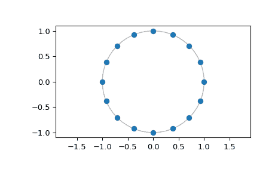

# `scipy.signal.czt_points`

> 原文链接：[`docs.scipy.org/doc/scipy-1.12.0/reference/generated/scipy.signal.czt_points.html#scipy.signal.czt_points`](https://docs.scipy.org/doc/scipy-1.12.0/reference/generated/scipy.signal.czt_points.html#scipy.signal.czt_points)

```py
scipy.signal.czt_points(m, w=None, a=1 + 0j)
```

返回进行啁啾变换的点。

参数：

**m**int

所需点的数量。

**w**复数，可选

每个步骤中点的比率。默认为均匀分布在整个单位圆周围的点。

**a**复数，可选

复平面中的起始点。默认为 1+0j。

返回：

**out**ndarray

Z 平面中的点，`CZT` 在调用时以复数*m*、*w*和*a*作为参数进行 z 变换采样。

另请参阅：

`CZT`

创建一个可调用的啁啾变换函数的类。

`czt`

用于快速计算 CZT 的便捷函数。

示例

绘制 16 点 FFT 的点：

```py
>>> import numpy as np
>>> from scipy.signal import czt_points
>>> points = czt_points(16)
>>> import matplotlib.pyplot as plt
>>> plt.plot(points.real, points.imag, 'o')
>>> plt.gca().add_patch(plt.Circle((0,0), radius=1, fill=False, alpha=.3))
>>> plt.axis('equal')
>>> plt.show() 
```



和一个穿过单位圆的 91 点对数螺旋：

```py
>>> m, w, a = 91, 0.995*np.exp(-1j*np.pi*.05), 0.8*np.exp(1j*np.pi/6)
>>> points = czt_points(m, w, a)
>>> plt.plot(points.real, points.imag, 'o')
>>> plt.gca().add_patch(plt.Circle((0,0), radius=1, fill=False, alpha=.3))
>>> plt.axis('equal')
>>> plt.show() 
```


