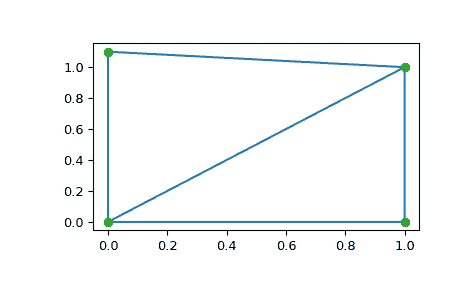

# `scipy.spatial.Delaunay`

> 原始文本：[`docs.scipy.org/doc/scipy-1.12.0/reference/generated/scipy.spatial.Delaunay.html#scipy.spatial.Delaunay`](https://docs.scipy.org/doc/scipy-1.12.0/reference/generated/scipy.spatial.Delaunay.html#scipy.spatial.Delaunay)

```py
class scipy.spatial.Delaunay(points, furthest_site=False, incremental=False, qhull_options=None)
```

N 维中的 Delaunay 镶嵌。

从版本 0.9 开始新增。

参数：

**points**浮点数数组，形状为（npoints，ndim）

要三角化的点的坐标

**furthest_site**布尔值，可选

是否计算最远点 Delaunay 三角剖分。默认值：False

从版本 0.12.0 开始新增。

**incremental**布尔值，可选

允许逐步添加新点。这会占用额外的资源。

**qhull_options**字符串，可选

传递给 Qhull 的其他选项。有关详细信息，请参阅 Qhull 手册。选项“Qt”始终启用。默认值：“Qbb Qc Qz Qx Q12”（对于 ndim > 4）和“Qbb Qc Qz Q12”（否则）。递增模式省略“Qz”。

从版本 0.12.0 开始新增。

引发：

QhullError

当 Qhull 遇到错误条件（例如在未启用解决选项的几何退化时）时引发。

ValueError

如果输入给出的数组不兼容，则引发。

注意

使用 Qhull 库计算的镶嵌 [Qhull library](http://www.qhull.org/)。

注意

除非您传入 Qhull 选项“QJ”，否则 Qhull 不保证每个输入点都会出现在 Delaunay 三角剖分的顶点中。省略的点在*coplanar*属性中列出。

示例

一组点的三角剖分：

```py
>>> import numpy as np
>>> points = np.array([[0, 0], [0, 1.1], [1, 0], [1, 1]])
>>> from scipy.spatial import Delaunay
>>> tri = Delaunay(points) 
```

我们可以绘制它：

```py
>>> import matplotlib.pyplot as plt
>>> plt.triplot(points[:,0], points[:,1], tri.simplices)
>>> plt.plot(points[:,0], points[:,1], 'o')
>>> plt.show() 
```



形成三角剖分的两个三角形的点的索引和坐标：

```py
>>> tri.simplices
array([[2, 3, 0],                 # may vary
 [3, 1, 0]], dtype=int32) 
```

请注意，根据舍入误差的处理方式，简单形可能与上述不同的顺序排列。

```py
>>> points[tri.simplices]
array([[[ 1\. ,  0\. ],            # may vary
 [ 1\. ,  1\. ],
 [ 0\. ,  0\. ]],
 [[ 1\. ,  1\. ],
 [ 0\. ,  1.1],
 [ 0\. ,  0\. ]]]) 
```

三角形 0 是三角形 1 的唯一相邻单元，并且它位于三角形 1 的顶点 1 的对面：

```py
>>> tri.neighbors[1]
array([-1,  0, -1], dtype=int32)
>>> points[tri.simplices[1,1]]
array([ 0\. ,  1.1]) 
```

我们可以找出哪些三角形点在：

```py
>>> p = np.array([(0.1, 0.2), (1.5, 0.5), (0.5, 1.05)])
>>> tri.find_simplex(p)
array([ 1, -1, 1], dtype=int32) 
```

数组中返回的整数是相应点所在单纯形的索引。如果返回-1，则表示该点不在任何单纯形中。请注意，以下示例中的快捷方式仅适用于有效点，因为无效点返回-1，而-1 本身是列表中最后一个单纯形的有效索引。

```py
>>> p_valids = np.array([(0.1, 0.2), (0.5, 1.05)])
>>> tri.simplices[tri.find_simplex(p_valids)]
array([[3, 1, 0],                 # may vary
 [3, 1, 0]], dtype=int32) 
```

我们还可以为这些点在三角形 1 中计算重心坐标：

```py
>>> b = tri.transform[1,:2].dot(np.transpose(p - tri.transform[1,2]))
>>> np.c_[np.transpose(b), 1 - b.sum(axis=0)]
array([[ 0.1       ,  0.09090909,  0.80909091],
 [ 1.5       , -0.90909091,  0.40909091],
 [ 0.5       ,  0.5       ,  0\.        ]]) 
```

第一个点的坐标全为正，这意味着它确实在三角形内部。第三个点在边缘上，因此其第三个坐标为空。

属性：

**points**双精度数组，形状为（npoints，ndim）

输入点的坐标。

**simplices**整数数组，形状为（nsimplex，ndim+1）

在三角形剖分中形成单纯形的点的索引。对于 2-D，点是逆时针方向排列的。

**neighbors**整数数组，形状为（nsimplex，ndim+1）

每个单纯形的相邻单纯形的索引。第 k 个相邻单纯形位于第 k 个顶点的对面。对于边界上的单纯形，-1 表示没有相邻单纯形。

**equations**双精度数组，形状为（nsimplex，ndim+2）

[normal, offset]构成抛物面上平面方程的超平面（详见[Qhull 文档](http://www.qhull.org/)）。 

**paraboloid_scale, paraboloid_shift**float

用于额外抛物面维度的缩放和移位（详见[Qhull 文档](http://www.qhull.org/)）。 

`transform`双精度数组，形状为 (nsimplex, ndim+1, ndim)

从`x`到重心坐标`c`的仿射变换。

`vertex_to_simplex`整数的 ndarray，形状为 (npoints,)

从顶点到其所属单纯形的查找数组。

`convex_hull`整数的 ndarray，形状为 (nfaces, ndim)

构成点集凸包的面的顶点。

**coplanar**整数的 ndarray，形状为 (ncoplanar, 3)

共面点的索引及其最近平面和最近顶点的相应索引。由于数值精度问题，共面点是未包含在三角剖分中的输入点。

如果未指定选项“Qc”，则不计算此列表。

新版本 0.12.0 中引入。

`vertex_neighbor_vertices`包含两个 int 类型的 ndarray 元组；(indptr, indices)

顶点的相邻顶点。

**furthest_site**

如果这是一个最远点三角剖分，则为 True；如果不是，则为 False。

新版本 1.4.0 中引入。

方法

| `add_points`(points[, restart]) | 处理一组额外的新点。 |
| --- | --- |
| `close`() | 完成增量处理。 |
| `find_simplex`(self, xi[, bruteforce, tol]) | 查找包含给定点的单纯形。 |
| `lift_points`(self, x) | 将点映射到 Qhull 抛物面上。 |
| `plane_distance`(self, xi) | 计算到所有单纯形点 *xi* 的超平面距离。 |
