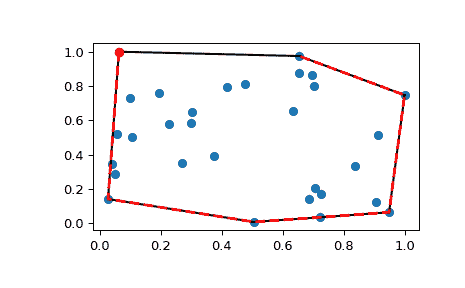
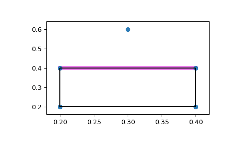

# `scipy.spatial.ConvexHull`

> 原文链接：[`docs.scipy.org/doc/scipy-1.12.0/reference/generated/scipy.spatial.ConvexHull.html#scipy.spatial.ConvexHull`](https://docs.scipy.org/doc/scipy-1.12.0/reference/generated/scipy.spatial.ConvexHull.html#scipy.spatial.ConvexHull)

```py
class scipy.spatial.ConvexHull(points, incremental=False, qhull_options=None)
```

N 维凸壳。

自版本 0.12.0 新增。

参数：

**points**：浮点型数组，形状为 (npoints, ndim)

构造凸壳的点的坐标

**incremental**：布尔值，可选

允许逐步添加新点。这会占用一些额外资源。

**qhull_options**：字符串，可选

传递给 Qhull 的其他选项。有关详细信息，请参阅 Qhull 手册。（默认值：对于 ndim > 4 为“Qx”，否则为“”）选项“Qt”始终启用。

引发：

QhullError

当 Qhull 遇到错误条件（如几何退化），且未启用解决选项时引发。

ValueError

如果输入的数组不兼容，则引发此错误。

注意

使用[Qhull 库](http://www.qhull.org/)计算凸壳。

参考文献

[Qhull]

[`www.qhull.org/`](http://www.qhull.org/)

示例

随机点集的凸壳：

```py
>>> from scipy.spatial import ConvexHull, convex_hull_plot_2d
>>> import numpy as np
>>> rng = np.random.default_rng()
>>> points = rng.random((30, 2))   # 30 random points in 2-D
>>> hull = ConvexHull(points) 
```

绘制它：

```py
>>> import matplotlib.pyplot as plt
>>> plt.plot(points[:,0], points[:,1], 'o')
>>> for simplex in hull.simplices:
...     plt.plot(points[simplex, 0], points[simplex, 1], 'k-') 
```

我们也可以直接使用外壳的顶点，对于二维情况保证顺时针排序：

```py
>>> plt.plot(points[hull.vertices,0], points[hull.vertices,1], 'r--', lw=2)
>>> plt.plot(points[hull.vertices[0],0], points[hull.vertices[0],1], 'ro')
>>> plt.show() 
```



从一个点可见的面片：

创建一个正方形，并在正方形上方添加一个点。

```py
>>> generators = np.array([[0.2, 0.2],
...                        [0.2, 0.4],
...                        [0.4, 0.4],
...                        [0.4, 0.2],
...                        [0.3, 0.6]]) 
```

使用 QG 选项调用 ConvexHull。QG4 表示计算不包括点 4 的外壳部分，指示从点 4 可见的面片。

```py
>>> hull = ConvexHull(points=generators,
...                   qhull_options='QG4') 
```

“good”数组指示从点 4 可见的面片。

```py
>>> print(hull.simplices)
 [[1 0]
 [1 2]
 [3 0]
 [3 2]]
>>> print(hull.good)
 [False  True False False] 
```

现在绘制它，突出显示可见的面片。

```py
>>> fig = plt.figure()
>>> ax = fig.add_subplot(1,1,1)
>>> for visible_facet in hull.simplices[hull.good]:
...     ax.plot(hull.points[visible_facet, 0],
...             hull.points[visible_facet, 1],
...             color='violet',
...             lw=6)
>>> convex_hull_plot_2d(hull, ax=ax)
 <Figure size 640x480 with 1 Axes> # may vary
>>> plt.show() 
```



属性：

**points**：双精度浮点型数组，形状为 (npoints, ndim)

输入点的坐标。

**vertices**：整型数组，形状为 (nvertices,)

形成凸壳顶点的点的索引。对于二维凸壳，顶点按逆时针顺序排列。对于其他维度，按输入顺序排列。

**simplices**：整型数组，形状为 (nfacet, ndim)

形成凸壳单纯面的点的索引。

**neighbors**：整型数组，形状为 (nfacet, ndim)

每个面片的相邻面片的索引。第 k 个相邻面片位于第 k 个顶点的对面。-1 表示没有相邻面片。

**equations**：双精度浮点型数组，形状为 (nfacet, ndim+1)

形成面的超平面方程 [normal, offset]（参见[Qhull 文档](http://www.qhull.org/)了解更多）。

**coplanar**：整型数组，形状为 (ncoplanar, 3)

共面点的索引及其最近面片和最近顶点索引的对应索引。由于数值精度问题，未包括在三角剖分中的输入点 *不* 被包括在内。

如果未指定选项“Qc”，则不计算此列表。

**good**：布尔型数组或 None

一个一维布尔数组，指示哪些面是好的。与计算好的面选项一起使用，例如 QGn 和 QG-n。好的面被定义为从点 n 可见（n）或不可见（-n）的面，其中 n 是‘points’中的第 n 个点。‘good’属性可用作‘simplices’的索引，以返回好的（可见）面：simplices[good]。仅从凸包的外部可见一个面，且既不共面也不退化计为可见性的情况。

如果未指定“QGn”或“QG-n”选项，则返回 None。

New in version 1.3.0.

**area**float

输入维度大于 2 时的凸包表面积。当输入[`points`](https://docs.scipy.org/doc/scipy/reference/generated/scipy.spatial.ConvexHull.html#scipy.spatial.ConvexHull.points "scipy.spatial.ConvexHull.points")为二维时，这是凸包的周长。

New in version 0.17.0.

**volume**float

输入维度大于 2 时的凸包体积。当输入[`points`](https://docs.scipy.org/doc/scipy/reference/generated/scipy.spatial.ConvexHull.html#scipy.spatial.ConvexHull.points "scipy.spatial.ConvexHull.points")为二维时，这是凸包的面积。

New in version 0.17.0.

方法

| [`add_points`](https://docs.scipy.org/doc/scipy/reference/generated/scipy.spatial.ConvexHull.html#scipy.spatial.ConvexHull.add_points "scipy.spatial.ConvexHull.add_points")(points[, restart]) | 处理一组额外的新点。 |
| --- | --- |
| [`close`](https://docs.scipy.org/doc/scipy/reference/generated/scipy.spatial.ConvexHull.html#scipy.spatial.ConvexHull.close "scipy.spatial.ConvexHull.close")() | 结束增量处理。 |
