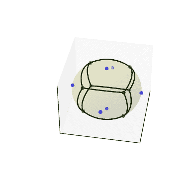

# `scipy.spatial.SphericalVoronoi`

> 原文：[`docs.scipy.org/doc/scipy-1.12.0/reference/generated/scipy.spatial.SphericalVoronoi.html#scipy.spatial.SphericalVoronoi`](https://docs.scipy.org/doc/scipy-1.12.0/reference/generated/scipy.spatial.SphericalVoronoi.html#scipy.spatial.SphericalVoronoi)

```py
class scipy.spatial.SphericalVoronoi(points, radius=1, center=None, threshold=1e-06)
```

球面上的 Voronoi 图。

版本 0.18.0 中的新内容。

参数：

**points**浮点数数组，形状为（npoints，ndim）

用于构建球面 Voronoi 图的点的坐标。

**radius**浮点数，可选

球的半径（默认值：1）

**center**浮点数数组，形状为（ndim，）

球的中心（默认值：原点）

**threshold**浮点数

用于检测重复点和点与球参数之间不匹配的阈值。（默认值：1e-06）

引发：

ValueError

如果*points*中有重复项。如果提供的*radius*与*points*不一致。

另请参阅

`Voronoi`

N 维空间中的传统 Voronoi 图。

注释

球面 Voronoi 图算法的步骤如下。计算输入点（生成器）的凸包，等同于它们在球面上的 Delaunay 三角剖分[[Caroli]](#r9133a064969a-caroli)。然后使用凸包的邻居信息来排序每个生成器周围的 Voronoi 区域顶点。后一种方法对浮点数问题的敏感性远低于基于角度的 Voronoi 区域顶点排序方法。

球面 Voronoi 算法性能的实证评估表明二次时间复杂度（对数线性是最佳的，但算法更难实现）。

参考文献

[Caroli]

Caroli 等人。球面上或接近球面的点的稳健且高效的 Delaunay 三角形。研究报告 RR-7004，2009 年。

[VanOosterom]

Van Oosterom 和 Strackee。平面三角形的立体角。IEEE 生物医学工程交易，1983 年，第 125-126 页。

示例

执行一些导入并在立方体上取一些点：

```py
>>> import numpy as np
>>> import matplotlib.pyplot as plt
>>> from scipy.spatial import SphericalVoronoi, geometric_slerp
>>> from mpl_toolkits.mplot3d import proj3d
>>> # set input data
>>> points = np.array([[0, 0, 1], [0, 0, -1], [1, 0, 0],
...                    [0, 1, 0], [0, -1, 0], [-1, 0, 0], ]) 
```

计算球面 Voronoi 图：

```py
>>> radius = 1
>>> center = np.array([0, 0, 0])
>>> sv = SphericalVoronoi(points, radius, center) 
```

生成绘图：

```py
>>> # sort vertices (optional, helpful for plotting)
>>> sv.sort_vertices_of_regions()
>>> t_vals = np.linspace(0, 1, 2000)
>>> fig = plt.figure()
>>> ax = fig.add_subplot(111, projection='3d')
>>> # plot the unit sphere for reference (optional)
>>> u = np.linspace(0, 2 * np.pi, 100)
>>> v = np.linspace(0, np.pi, 100)
>>> x = np.outer(np.cos(u), np.sin(v))
>>> y = np.outer(np.sin(u), np.sin(v))
>>> z = np.outer(np.ones(np.size(u)), np.cos(v))
>>> ax.plot_surface(x, y, z, color='y', alpha=0.1)
>>> # plot generator points
>>> ax.scatter(points[:, 0], points[:, 1], points[:, 2], c='b')
>>> # plot Voronoi vertices
>>> ax.scatter(sv.vertices[:, 0], sv.vertices[:, 1], sv.vertices[:, 2],
...                    c='g')
>>> # indicate Voronoi regions (as Euclidean polygons)
>>> for region in sv.regions:
...    n = len(region)
...    for i in range(n):
...        start = sv.vertices[region][i]
...        end = sv.vertices[region][(i + 1) % n]
...        result = geometric_slerp(start, end, t_vals)
...        ax.plot(result[..., 0],
...                result[..., 1],
...                result[..., 2],
...                c='k')
>>> ax.azim = 10
>>> ax.elev = 40
>>> _ = ax.set_xticks([])
>>> _ = ax.set_yticks([])
>>> _ = ax.set_zticks([])
>>> fig.set_size_inches(4, 4)
>>> plt.show() 
```



属性：

**points**双精度数组，形状为（npoints，ndim）

从*ndim*维度中的点生成 Voronoi 图。

**radius**双精度

球的半径

**center**双精度数组，形状为（ndim，）

球的中心

**vertices**双精度数组，形状为（nvertices，ndim）

对应于点的 Voronoi 顶点

**regions**整数列表的列表，形状为（npoints，_ ）

第 n 个条目是由属于点中第 n 个点的顶点的索引组成的列表

方法

| `calculate_areas`() | 计算 Voronoi 区域的面积。 |
| --- | --- |
