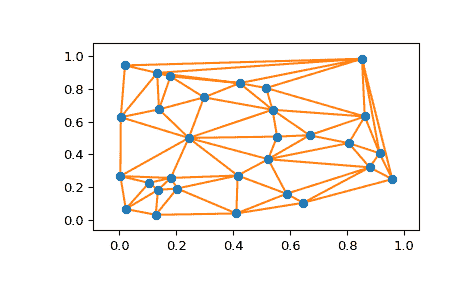

# `scipy.spatial.delaunay_plot_2d`

> 原文链接：[`docs.scipy.org/doc/scipy-1.12.0/reference/generated/scipy.spatial.delaunay_plot_2d.html#scipy.spatial.delaunay_plot_2d`](https://docs.scipy.org/doc/scipy-1.12.0/reference/generated/scipy.spatial.delaunay_plot_2d.html#scipy.spatial.delaunay_plot_2d)

```py
scipy.spatial.delaunay_plot_2d(tri, ax=None)
```

在二维中绘制给定的 Delaunay 三角剖分

参数：

**tri**scipy.spatial.Delaunay 实例

要绘制的三角剖分

**ax**matplotlib.axes.Axes 实例，可选

绘图所用的坐标轴

返回：

**fig**matplotlib.figure.Figure 实例

绘图的图表

另请参见

`Delaunay`

[`matplotlib.pyplot.triplot`](https://matplotlib.org/stable/api/_as_gen/matplotlib.pyplot.triplot.html#matplotlib.pyplot.triplot "(在 Matplotlib v3.8.2 中)")

笔记

需要 Matplotlib。

示例

```py
>>> import numpy as np
>>> import matplotlib.pyplot as plt
>>> from scipy.spatial import Delaunay, delaunay_plot_2d 
```

一组随机点的 Delaunay 三角剖分：

```py
>>> rng = np.random.default_rng()
>>> points = rng.random((30, 2))
>>> tri = Delaunay(points) 
```

将其绘制出来：

```py
>>> _ = delaunay_plot_2d(tri)
>>> plt.show() 
```


