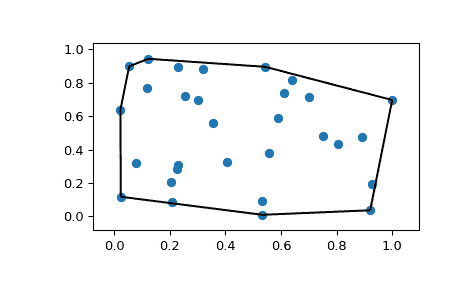

# `scipy.spatial.convex_hull_plot_2d`

> 原文链接：[`docs.scipy.org/doc/scipy-1.12.0/reference/generated/scipy.spatial.convex_hull_plot_2d.html#scipy.spatial.convex_hull_plot_2d`](https://docs.scipy.org/doc/scipy-1.12.0/reference/generated/scipy.spatial.convex_hull_plot_2d.html#scipy.spatial.convex_hull_plot_2d)

```py
scipy.spatial.convex_hull_plot_2d(hull, ax=None)
```

在二维中绘制给定的凸包图形

参数：

**hull** 是 `scipy.spatial.ConvexHull` 的实例

要绘制的凸包

**ax** 是 `matplotlib.axes.Axes` 的实例，可选

绘制的坐标轴

返回：

**fig** 是 `matplotlib.figure.Figure` 的实例

绘图的图形

请参阅

`ConvexHull`

注意事项

需要 Matplotlib。

示例

```py
>>> import numpy as np
>>> import matplotlib.pyplot as plt
>>> from scipy.spatial import ConvexHull, convex_hull_plot_2d 
```

随机点集的凸包：

```py
>>> rng = np.random.default_rng()
>>> points = rng.random((30, 2))
>>> hull = ConvexHull(points) 
```

绘制图形：

```py
>>> _ = convex_hull_plot_2d(hull)
>>> plt.show() 
```


