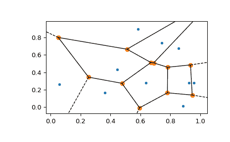
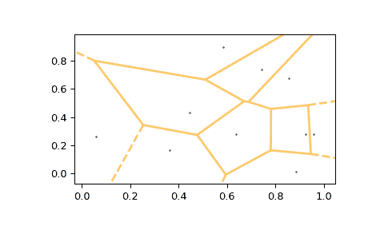

# `scipy.spatial.voronoi_plot_2d`

> 原文：[`docs.scipy.org/doc/scipy-1.12.0/reference/generated/scipy.spatial.voronoi_plot_2d.html#scipy.spatial.voronoi_plot_2d`](https://docs.scipy.org/doc/scipy-1.12.0/reference/generated/scipy.spatial.voronoi_plot_2d.html#scipy.spatial.voronoi_plot_2d)

```py
scipy.spatial.voronoi_plot_2d(vor, ax=None, **kw)
```

绘制给定的 2-D Voronoi 图

参数：

**vor**scipy.spatial.Voronoi 实例

绘图的图表

**ax**matplotlib.axes.Axes 实例，可选

绘图的轴

**show_points**布尔值，可选

将 Voronoi 点添加到图表。

**show_vertices**布尔值，可选

将 Voronoi 顶点添加到图表。

**line_colors**字符串，可选

指定多边形边界的线颜色

**line_width**浮点数，可选

指定多边形边界的线宽

**line_alpha**浮点数，可选

指定多边形边界的线透明度

**point_size**浮点数，可选

指定点的大小

返回：

**fig**matplotlib.figure.Figure 实例

图表的图例

参见

[`Voronoi`](https://docs.scipy.org/doc/scipy-1.12.0/reference/generated/scipy.spatial.Voronoi.html#scipy.spatial.Voronoi "scipy.spatial.Voronoi")

注意

需要 Matplotlib。

示例

```py
>>> import numpy as np
>>> import matplotlib.pyplot as plt
>>> from scipy.spatial import Voronoi, voronoi_plot_2d 
```

为示例创建一组点：

```py
>>> rng = np.random.default_rng()
>>> points = rng.random((10,2)) 
```

为这些点生成 Voronoi 图：

```py
>>> vor = Voronoi(points) 
```

使用[`voronoi_plot_2d`](https://docs.scipy.org/doc/scipy-1.12.0/reference/generated/scipy.spatial.voronoi_plot_2d.html#scipy.spatial.voronoi_plot_2d)绘制图表：

```py
>>> fig = voronoi_plot_2d(vor) 
```

使用[`voronoi_plot_2d`](https://docs.scipy.org/doc/scipy-1.12.0/reference/generated/scipy.spatial.voronoi_plot_2d.html#scipy.spatial.voronoi_plot_2d "scipy.spatial.voronoi_plot_2d")再次绘制图表，并自定义一些设置：

```py
>>> fig = voronoi_plot_2d(vor, show_vertices=False, line_colors='orange',
...                       line_width=2, line_alpha=0.6, point_size=2)
>>> plt.show() 
```


