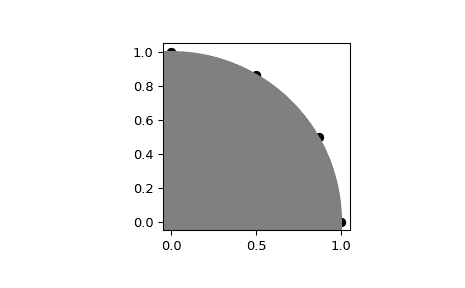
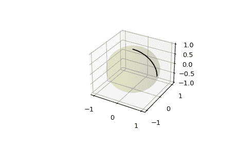

# `scipy.spatial.geometric_slerp`

> 原文：[`docs.scipy.org/doc/scipy-1.12.0/reference/generated/scipy.spatial.geometric_slerp.html#scipy.spatial.geometric_slerp`](https://docs.scipy.org/doc/scipy-1.12.0/reference/generated/scipy.spatial.geometric_slerp.html#scipy.spatial.geometric_slerp)

```py
scipy.spatial.geometric_slerp(start, end, t, tol=1e-07)
```

几何球形线性插值。

插值沿任意维度空间中的单位半径大圆弧进行。

参数：

**start**(n_dimensions, ) 数组样式

在 1-D 数组样式对象中，单个 n 维输入坐标。*n* 必须大于 1。

**end**(n_dimensions, ) 数组样式

在 1-D 数组样式对象中，单个 n 维输入坐标。*n* 必须大于 1。

**t**float 或 (n_points,) 1D 数组样式

表示插值参数的双精度浮点数或 1D 数组样式，其值在包含的区间 [0, 1] 内。一种常见方法是使用 `np.linspace(0, 1, n_pts)` 生成数组以获取线性间隔点。允许升序、降序和打乱顺序。

**tol**float

用于确定起始和结束坐标是否为反极的绝对容差。

返回：

**result**(t.size, D)

包含插值球形路径的双精度数组，当使用 0 和 1 的 t 时，包括起点和终点。插值值应与 t 数组中提供的相同排序顺序对应。如果 `t` 是浮点数，则结果可能是一维的。

引发：

ValueError

如果 `start` 和 `end` 是反极，不在单位 n-球上，或者存在各种退化条件。

另请参见

[`scipy.spatial.transform.Slerp`](https://docs.scipy.org/doc/scipy-1.12.0/reference/generated/scipy.spatial.geometric_slerp.html#scipy.spatial.transform.Slerp "scipy.spatial.transform.Slerp")

与四元数一起工作的 3-D Slerp

注释

实现基于数学公式提供的，来源于对 4-D 几何学的研究，由 Ken Shoemake 的原始四元数 Slerp 发表中的一个脚注中认可的算法。

新功能版本 1.5.0。

参考文献

[1]

[`en.wikipedia.org/wiki/Slerp#Geometric_Slerp`](https://en.wikipedia.org/wiki/Slerp#Geometric_Slerp)

[2]

Ken Shoemake（1985）Animating rotation with quaternion curves. ACM SIGGRAPH Computer Graphics，19（3）：245-254。

示例

在跨越 90 度的圆周上插值四个线性间隔的值：

```py
>>> import numpy as np
>>> from scipy.spatial import geometric_slerp
>>> import matplotlib.pyplot as plt
>>> fig = plt.figure()
>>> ax = fig.add_subplot(111)
>>> start = np.array([1, 0])
>>> end = np.array([0, 1])
>>> t_vals = np.linspace(0, 1, 4)
>>> result = geometric_slerp(start,
...                          end,
...                          t_vals) 
```

插值结果应在单位圆上的 30 度间隔可识别：

```py
>>> ax.scatter(result[...,0], result[...,1], c='k')
>>> circle = plt.Circle((0, 0), 1, color='grey')
>>> ax.add_artist(circle)
>>> ax.set_aspect('equal')
>>> plt.show() 
```



尝试在圆的反极之间插值是模棱两可的，因为存在两条可能的路径；在球体上存在无限可能的测地线路径。尽管如此，一个模棱两可的路径会连同警告返回：

```py
>>> opposite_pole = np.array([-1, 0])
>>> with np.testing.suppress_warnings() as sup:
...     sup.filter(UserWarning)
...     geometric_slerp(start,
...                     opposite_pole,
...                     t_vals)
array([[ 1.00000000e+00,  0.00000000e+00],
 [ 5.00000000e-01,  8.66025404e-01],
 [-5.00000000e-01,  8.66025404e-01],
 [-1.00000000e+00,  1.22464680e-16]]) 
```

将原始示例扩展到球体并在 3D 中绘制插值点：

```py
>>> from mpl_toolkits.mplot3d import proj3d
>>> fig = plt.figure()
>>> ax = fig.add_subplot(111, projection='3d') 
```

绘制单位球作为参考（可选）：

```py
>>> u = np.linspace(0, 2 * np.pi, 100)
>>> v = np.linspace(0, np.pi, 100)
>>> x = np.outer(np.cos(u), np.sin(v))
>>> y = np.outer(np.sin(u), np.sin(v))
>>> z = np.outer(np.ones(np.size(u)), np.cos(v))
>>> ax.plot_surface(x, y, z, color='y', alpha=0.1) 
```

在球面上插值更多点可能会使曲线看起来更加平滑，这对球面上的离散积分计算也很有用：

```py
>>> start = np.array([1, 0, 0])
>>> end = np.array([0, 0, 1])
>>> t_vals = np.linspace(0, 1, 200)
>>> result = geometric_slerp(start,
...                          end,
...                          t_vals)
>>> ax.plot(result[...,0],
...         result[...,1],
...         result[...,2],
...         c='k')
>>> plt.show() 
```


