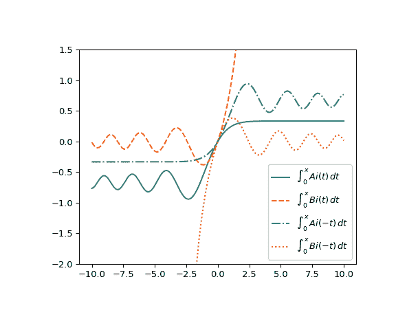

# `scipy.special.itairy`

> 原文链接：[`docs.scipy.org/doc/scipy-1.12.0/reference/generated/scipy.special.itairy.html#scipy.special.itairy`](https://docs.scipy.org/doc/scipy-1.12.0/reference/generated/scipy.special.itairy.html#scipy.special.itairy)

```py
scipy.special.itairy(x, out=None) = <ufunc 'itairy'>
```

Airy 函数的积分

计算从 0 到 *x* 的 Airy 函数的积分。

参数：

**x**类似数组

积分的上限（浮点数）。

**输出**一组 ndarray 的元组，可选

函数值的可选输出数组

返回：

**适当**标量或 ndarray

对于 Ai(t) 从 0 到 x 的积分。

**下**标量或 ndarray

对于 Bi(t) 从 0 到 x 的积分。

**上**标量或 ndarray

对于 Ai(-t) 从 0 到 x 的积分。

**下**标量或 ndarray

对于 Bi(-t) 从 0 到 x 的积分。

注意

由张善杰和金建明创建的 Fortran 例程包装器 [[1]](#r499eeb689250-1)。

参考资料

[1]

张善杰和金建明。“特殊函数的计算”，John Wiley and Sons，1996 年。[`people.sc.fsu.edu/~jburkardt/f_src/special_functions/special_functions.html`](https://people.sc.fsu.edu/~jburkardt/f_src/special_functions/special_functions.html)

示例

在 `x=1.` 处计算函数。

```py
>>> import numpy as np
>>> from scipy.special import itairy
>>> import matplotlib.pyplot as plt
>>> apt, bpt, ant, bnt = itairy(1.)
>>> apt, bpt, ant, bnt
(0.23631734191710949,
 0.8727691167380077,
 0.46567398346706845,
 0.3730050096342943) 
```

通过为 *x* 提供一个 NumPy 数组来计算几个点上的函数。

```py
>>> x = np.array([1., 1.5, 2.5, 5])
>>> apt, bpt, ant, bnt = itairy(x)
>>> apt, bpt, ant, bnt
(array([0.23631734, 0.28678675, 0.324638  , 0.33328759]),
 array([  0.87276912,   1.62470809,   5.20906691, 321.47831857]),
 array([0.46567398, 0.72232876, 0.93187776, 0.7178822 ]),
 array([ 0.37300501,  0.35038814, -0.02812939,  0.15873094])) 
```

将函数从 -10 到 10 绘制出来。

```py
>>> x = np.linspace(-10, 10, 500)
>>> apt, bpt, ant, bnt = itairy(x)
>>> fig, ax = plt.subplots(figsize=(6, 5))
>>> ax.plot(x, apt, label="$\int_0^x\, Ai(t)\, dt$")
>>> ax.plot(x, bpt, ls="dashed", label="$\int_0^x\, Bi(t)\, dt$")
>>> ax.plot(x, ant, ls="dashdot", label="$\int_0^x\, Ai(-t)\, dt$")
>>> ax.plot(x, bnt, ls="dotted", label="$\int_0^x\, Bi(-t)\, dt$")
>>> ax.set_ylim(-2, 1.5)
>>> ax.legend(loc="lower right")
>>> plt.show() 
```


