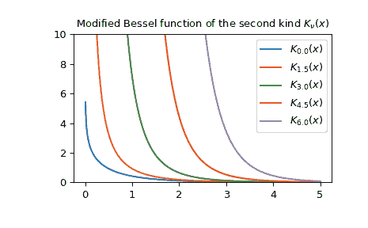

# `scipy.special.kv`

> 原文：[`docs.scipy.org/doc/scipy-1.12.0/reference/generated/scipy.special.kv.html#scipy.special.kv`](https://docs.scipy.org/doc/scipy-1.12.0/reference/generated/scipy.special.kv.html#scipy.special.kv)

```py
scipy.special.kv(v, z, out=None) = <ufunc 'kv'>
```

实数阶 *v* 的修改贝塞尔函数的第二类

返回复数阶 *v* 的修改贝塞尔函数的第二类。

这些有时也称为第三类函数，巴赛特函数或麦克唐纳函数。它们被定义为修改贝塞尔方程的解，其特征为，

\[K_v(x) \sim \sqrt{\pi/(2x)} \exp(-x)\]

当 \(x \to \infty\) [[3]](#r11384e94d51c-3).

参数：

**v** 浮点数数组

贝塞尔函数的阶数

**z** 复数数组

评估贝塞尔函数的参数

**out** ndarray，可选

用于存储函数结果的可选输出数组

返回：

标量或 ndarray

结果。请注意，输入必须是复数类型才能获得复数输出，例如 `kv(3, -2+0j)` 而不是 `kv(3, -2)`。

参见

`kve`

除去主导指数行为的函数。

`kvp`

此函数的导数

注意

AMOS 的包装器 [[1]](#r11384e94d51c-1) 例程 *zbesk*。关于所使用的算法的讨论，请参见 [[2]](#r11384e94d51c-2) 及其中的参考文献。

参考文献

[1]

Donald E. Amos，“AMOS，一种复数参数和非负阶贝塞尔函数的便携包”，[`netlib.org/amos/`](http://netlib.org/amos/)

[2]

Donald E. Amos，“算法 644：一种复数参数和非负阶贝塞尔函数的便携包”，ACM TOMS Vol. 12 Issue 3，1986 年 9 月，第 265 页

[3]

NIST 数字数学函数库，方程 10.25.E3\. [`dlmf.nist.gov/10.25.E3`](https://dlmf.nist.gov/10.25.E3)

示例

绘制实数输入的多个阶数的函数

```py
>>> import numpy as np
>>> from scipy.special import kv
>>> import matplotlib.pyplot as plt
>>> x = np.linspace(0, 5, 1000)
>>> for N in np.linspace(0, 6, 5):
...     plt.plot(x, kv(N, x), label='$K_{{{}}}(x)$'.format(N))
>>> plt.ylim(0, 10)
>>> plt.legend()
>>> plt.title(r'Modified Bessel function of the second kind $K_\nu(x)$')
>>> plt.show() 
```



对多个阶数的单个值进行计算：

```py
>>> kv([4, 4.5, 5], 1+2j)
array([ 0.1992+2.3892j,  2.3493+3.6j   ,  7.2827+3.8104j]) 
```
