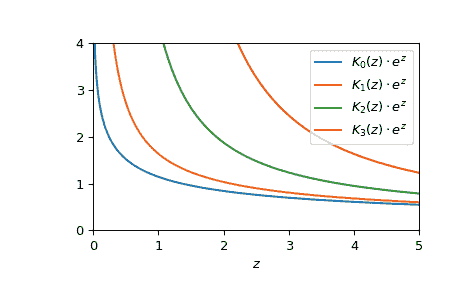

# `scipy.special.kve`

> 原始文本：[`docs.scipy.org/doc/scipy-1.12.0/reference/generated/scipy.special.kve.html#scipy.special.kve`](https://docs.scipy.org/doc/scipy-1.12.0/reference/generated/scipy.special.kve.html#scipy.special.kve)

```py
scipy.special.kve(v, z, out=None) = <ufunc 'kve'>
```

指数尺度修正的第二类贝塞尔函数。

返回指数尺度的修正第二类（有时称为第三类）贝塞尔函数，对于复数*z*的真实阶*v*：

```py
kve(v, z) = kv(v, z) * exp(z) 
```

参数：

**v**浮点数的数组

贝塞尔函数的阶数

**z**复合的数组

评估贝塞尔函数的参数。

**out**，可选的 ndarray

函数结果的可选输出数组

返回：

标量或 ndarray

指数尺度修正的第二类贝塞尔函数。

另请参阅

`kv`

没有指数尺度的此函数。

`k0e`

此函数的顺序 0 的更快版本。

`k1e`

此函数的顺序 1 的更快版本。

注释

AMOS 的包装器[[1]](#r39375146556b-1)例程*zbesk*。有关所用算法的讨论，请参见[[2]](#r39375146556b-2)及其引用。

参考文献

[1]

Donald E. Amos，“AMOS，一种用于复参数和非负顺序的贝塞尔函数的便携式包装”，[`netlib.org/amos/`](http://netlib.org/amos/)

[2]

Donald E. Amos，“算法 644：一种用于复参数和非负顺序的贝塞尔函数的便携式包装”，ACM TOMS Vol. 12 Issue 3，1986 年 9 月，第 265 页

示例

在以下示例中，`kv`返回 0，而`kve`仍然返回一个有用的有限数。

```py
>>> import numpy as np
>>> from scipy.special import kv, kve
>>> import matplotlib.pyplot as plt
>>> kv(3, 1000.), kve(3, 1000.)
(0.0, 0.03980696128440973) 
```

通过为*v*参数提供列表或 NumPy 数组作为参数，对不同顺序的一个点评估函数：

```py
>>> kve([0, 1, 1.5], 1.)
array([1.14446308, 1.63615349, 2.50662827]) 
```

评估函数在多个点处对零阶进行处理，通过为*z*提供一个数组。

```py
>>> points = np.array([1., 3., 10.])
>>> kve(0, points)
array([1.14446308, 0.6977616 , 0.39163193]) 
```

通过为*v*和*z*提供数组，以不同的顺序评估多个点的函数。这两个数组必须能够广播到正确的形状。为了计算一维点的顺序 0、1 和 2：

```py
>>> kve([[0], [1], [2]], points)
array([[1.14446308, 0.6977616 , 0.39163193],
 [1.63615349, 0.80656348, 0.41076657],
 [4.41677005, 1.23547058, 0.47378525]]) 
```

绘制阶数从 0 到 3 的函数，从 0 到 5。

```py
>>> fig, ax = plt.subplots()
>>> x = np.linspace(0., 5., 1000)
>>> for i in range(4):
...     ax.plot(x, kve(i, x), label=f'$K_{i!r}(z)\cdot e^z$')
>>> ax.legend()
>>> ax.set_xlabel(r"$z$")
>>> ax.set_ylim(0, 4)
>>> ax.set_xlim(0, 5)
>>> plt.show() 
```


