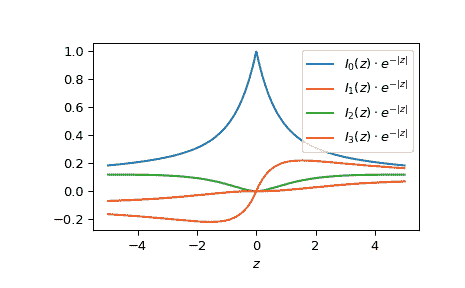

# `scipy.special.ive`

> 原文：[`docs.scipy.org/doc/scipy-1.12.0/reference/generated/scipy.special.ive.html#scipy.special.ive`](https://docs.scipy.org/doc/scipy-1.12.0/reference/generated/scipy.special.ive.html#scipy.special.ive)

```py
scipy.special.ive(v, z, out=None) = <ufunc 'ive'>
```

指数尺度修正的第一类修正贝塞尔函数。

定义如下：

```py
ive(v, z) = iv(v, z) * exp(-abs(z.real)) 
```

对于没有实部的虚数，返回第一类贝塞尔函数的非尺度版本`iv`。

参数：

**v**浮点数的数组

阶数。

**z**浮点数或复数的数组

参数。

**out** ndarray，可选

函数值的可选输出数组

返回：

标量或 ndarray

指数尺度修正的修正贝塞尔函数的值。

另请参阅

`iv`

第一类修正贝塞尔函数

`i0e`

该函数在阶数 0 时的更快实现

`i1e`

该函数在阶数 1 时的更快实现

注意事项

对于正*v*，调用 AMOS [[1]](#rd3ac0c69ec97-1) *zbesi*例程。它使用小*z*的幂级数，大*abs(z)*的渐近展开，通过 Wronskian 归一化的 Miller 算法以及中间数量的 Neumann 级数，并且针对大阶数的\(I_v(z)\)和\(J_v(z)\)使用均匀渐近展开。必要时使用后向递归生成序列或减少阶数。

上述计算在右半平面完成，并通过公式延续到左半平面，

\[I_v(z \exp(\pm\imath\pi)) = \exp(\pm\pi v) I_v(z)\]

（当*z*的实部为正时）对于负*v*，公式

\[I_{-v}(z) = I_v(z) + \frac{2}{\pi} \sin(\pi v) K_v(z)\]

使用*zbesk*例程评估修正贝塞尔函数第二类*K_v(z)*。

对于大的参数*z*，`ive`是有用的：对于这些参数，`iv`很容易溢出，而`ive`由于指数尺度而不会溢出。

参考文献

[1]

Donald E. Amos, “AMOS, A Portable Package for Bessel Functions of a Complex Argument and Nonnegative Order”, [`netlib.org/amos/`](http://netlib.org/amos/)

示例

在以下示例中`iv`返回无穷大，而`ive`仍然返回有限数。

```py
>>> from scipy.special import iv, ive
>>> import numpy as np
>>> import matplotlib.pyplot as plt
>>> iv(3, 1000.), ive(3, 1000.)
(inf, 0.01256056218254712) 
```

通过将列表或 NumPy 数组作为*v*参数的参数，评估不同阶数的一个点上的函数：

```py
>>> ive([0, 1, 1.5], 1.)
array([0.46575961, 0.20791042, 0.10798193]) 
```

通过提供一个*z*数组，对阶数 0 的多个点评估函数。

```py
>>> points = np.array([-2., 0., 3.])
>>> ive(0, points)
array([0.30850832, 1\.        , 0.24300035]) 
```

通过为*v*和*z*提供可广播到正确形状的数组，对不同阶数的几个点评估函数。要计算一维点数组的 0、1 和 2 阶：

```py
>>> ive([[0], [1], [2]], points)
array([[ 0.30850832,  1\.        ,  0.24300035],
 [-0.21526929,  0\.        ,  0.19682671],
 [ 0.09323903,  0\.        ,  0.11178255]]) 
```

绘制从-5 到 5 的 0 到 3 阶函数。

```py
>>> fig, ax = plt.subplots()
>>> x = np.linspace(-5., 5., 1000)
>>> for i in range(4):
...     ax.plot(x, ive(i, x), label=f'$I_{i!r}(z)\cdot e^{{-|z|}}$')
>>> ax.legend()
>>> ax.set_xlabel(r"$z$")
>>> plt.show() 
```


