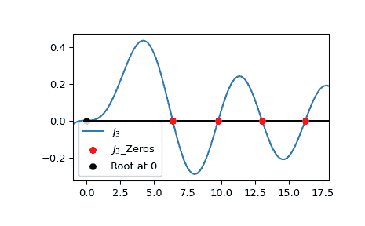

# `scipy.special.jn_zeros`

> 原文：[`docs.scipy.org/doc/scipy-1.12.0/reference/generated/scipy.special.jn_zeros.html#scipy.special.jn_zeros`](https://docs.scipy.org/doc/scipy-1.12.0/reference/generated/scipy.special.jn_zeros.html#scipy.special.jn_zeros)

```py
scipy.special.jn_zeros(n, nt)
```

计算整数阶 Bessel 函数 Jn 的零点。

在区间 \((0, \infty)\) 上计算 Bessel 函数 \(J_n(x)\) 的前 *nt* 个零点。这些零点按升序返回。请注意，此区间不包括对于 \(n > 0\) 存在于 \(x = 0\) 处的零点。

参数：

**n** int

Bessel 函数的阶数

**nt** int

要返回的零点数量

返回：

ndarray

Bessel 函数的前 *nt* 个零点。

另见

`jv`

第一类实阶 Bessel 函数

`jnp_zeros`

\(Jn'\) 的零点

参考文献

[1]

张善杰和金建明著。“特殊函数的计算”，约翰·威利与儿子，1996 年，第五章。[`people.sc.fsu.edu/~jburkardt/f77_src/special_functions/special_functions.html`](https://people.sc.fsu.edu/~jburkardt/f77_src/special_functions/special_functions.html)

示例

计算 \(J_3\) 的前四个正根。

```py
>>> from scipy.special import jn_zeros
>>> jn_zeros(3, 4)
array([ 6.3801619 ,  9.76102313, 13.01520072, 16.22346616]) 
```

绘制 \(J_3\) 及其前四个正根。请注意，位于 0 处的根不由 `jn_zeros` 返回。

```py
>>> import numpy as np
>>> import matplotlib.pyplot as plt
>>> from scipy.special import jn, jn_zeros
>>> j3_roots = jn_zeros(3, 4)
>>> xmax = 18
>>> xmin = -1
>>> x = np.linspace(xmin, xmax, 500)
>>> fig, ax = plt.subplots()
>>> ax.plot(x, jn(3, x), label=r'$J_3$')
>>> ax.scatter(j3_roots, np.zeros((4, )), s=30, c='r',
...            label=r"$J_3$_Zeros", zorder=5)
>>> ax.scatter(0, 0, s=30, c='k',
...            label=r"Root at 0", zorder=5)
>>> ax.hlines(0, 0, xmax, color='k')
>>> ax.set_xlim(xmin, xmax)
>>> plt.legend()
>>> plt.show() 
```


