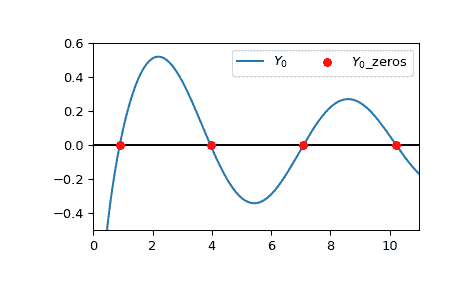

# `scipy.special.y0_zeros`

> 原文：[`docs.scipy.org/doc/scipy-1.12.0/reference/generated/scipy.special.y0_zeros.html#scipy.special.y0_zeros`](https://docs.scipy.org/doc/scipy-1.12.0/reference/generated/scipy.special.y0_zeros.html#scipy.special.y0_zeros)

```py
scipy.special.y0_zeros(nt, complex=False)
```

计算贝塞尔函数\(Y0(z)\)的 nt 个零点，以及每个零点处的导数。

导数由每个零点\(z0\)处的\(Y0’(z0) = -Y1(z0)\)给出。

参数：

**nt**int

返回零点的数量

**complex**bool，默认为 False

将其设置为 False 以仅返回实根；将其设置为 True 以仅返回具有负实部和正虚部的复根。请注意，后者的复共轭也是函数的零点，但此例程不返回它们。

返回：

**z0n**ndarray

第 n 个\(Y0(z)\)的零点位置

**y0pz0n**ndarray

第 n 个零点处的导数\(Y0’(z0)\)

参考资料

[1]

张善杰和金建明。“特殊函数的计算”，John Wiley and Sons，1996 年，第五章。[`people.sc.fsu.edu/~jburkardt/f77_src/special_functions/special_functions.html`](https://people.sc.fsu.edu/~jburkardt/f77_src/special_functions/special_functions.html)

示例

计算\(Y_0\)的前 4 个实根及其根处的导数：

```py
>>> import numpy as np
>>> from scipy.special import y0_zeros
>>> zeros, grads = y0_zeros(4)
>>> with np.printoptions(precision=5):
...     print(f"Roots: {zeros}")
...     print(f"Gradients: {grads}")
Roots: [ 0.89358+0.j  3.95768+0.j  7.08605+0.j 10.22235+0.j]
Gradients: [-0.87942+0.j  0.40254+0.j -0.3001 +0.j  0.2497 +0.j] 
```

绘制\(Y_0\)的实部和前四个计算得到的根。

```py
>>> import matplotlib.pyplot as plt
>>> from scipy.special import y0
>>> xmin = 0
>>> xmax = 11
>>> x = np.linspace(xmin, xmax, 500)
>>> fig, ax = plt.subplots()
>>> ax.hlines(0, xmin, xmax, color='k')
>>> ax.plot(x, y0(x), label=r'$Y_0$')
>>> zeros, grads = y0_zeros(4)
>>> ax.scatter(zeros.real, np.zeros((4, )), s=30, c='r',
...            label=r'$Y_0$_zeros', zorder=5)
>>> ax.set_ylim(-0.5, 0.6)
>>> ax.set_xlim(xmin, xmax)
>>> plt.legend(ncol=2)
>>> plt.show() 
```



通过设置`complex=True`计算\(Y_0\)的前 4 个复根及其根处的导数：

```py
>>> y0_zeros(4, True)
(array([ -2.40301663+0.53988231j,  -5.5198767 +0.54718001j,
 -8.6536724 +0.54841207j, -11.79151203+0.54881912j]),
 array([ 0.10074769-0.88196771j, -0.02924642+0.5871695j ,
 0.01490806-0.46945875j, -0.00937368+0.40230454j])) 
```
