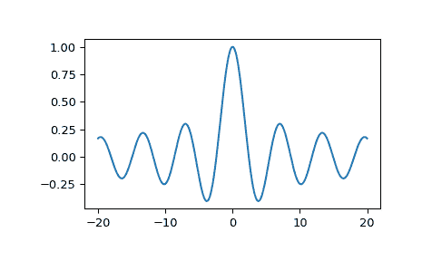

# `scipy.special.j0`

> 原文：[`docs.scipy.org/doc/scipy-1.12.0/reference/generated/scipy.special.j0.html#scipy.special.j0`](https://docs.scipy.org/doc/scipy-1.12.0/reference/generated/scipy.special.j0.html#scipy.special.j0)

```py
scipy.special.j0(x, out=None) = <ufunc 'j0'>
```

零阶第一类贝塞尔函数。

参数：

**x** 类似数组

参数（浮点数）。

**out** ndarray, 可选

可选的函数值输出数组

返回：

**J**标量或 ndarray

*x* 处零阶第一类贝塞尔函数的值。

参见

`jv`

实数阶贝塞尔函数和复数参数的贝塞尔函数。

`spherical_jn`

球面贝塞尔函数。

注释

将域分为区间[0, 5]和(5, 无穷大)。在第一个区间内使用以下有理近似：

\[J_0(x) \approx (w - r_1²)(w - r_2²) \frac{P_3(w)}{Q_8(w)},\]

其中 \(w = x²\)，\(r_1\)、\(r_2\) 是 \(J_0\) 的零点，\(P_3\) 和 \(Q_8\) 是分别为 3 和 8 次的多项式。

在第二区间内，使用 Hankel 渐近展开，其中包括两个 6/6 和 7/7 次有理函数。

此函数是 Cephes 的[[1]](#rdcbfe569ff9e-1)例程`j0`的包装。请勿与球面贝塞尔函数混淆（参见`spherical_jn`）。

参考资料

[1]

Cephes 数学函数库，[`www.netlib.org/cephes/`](http://www.netlib.org/cephes/)

示例

计算单点函数：

```py
>>> from scipy.special import j0
>>> j0(1.)
0.7651976865579665 
```

计算多点函数：

```py
>>> import numpy as np
>>> j0(np.array([-2., 0., 4.]))
array([ 0.22389078,  1\.        , -0.39714981]) 
```

绘制从-20 到 20 的函数图像。

```py
>>> import matplotlib.pyplot as plt
>>> fig, ax = plt.subplots()
>>> x = np.linspace(-20., 20., 1000)
>>> y = j0(x)
>>> ax.plot(x, y)
>>> plt.show() 
```


