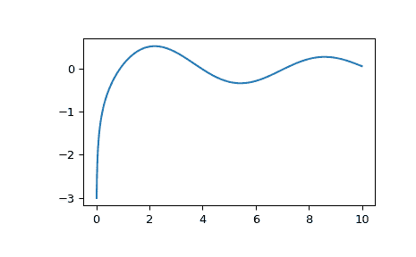

# `scipy.special.y0`

> 原文：[`docs.scipy.org/doc/scipy-1.12.0/reference/generated/scipy.special.y0.html#scipy.special.y0`](https://docs.scipy.org/doc/scipy-1.12.0/reference/generated/scipy.special.y0.html#scipy.special.y0)

```py
scipy.special.y0(x, out=None) = <ufunc 'y0'>
```

零阶第二类贝塞尔函数。

参数：

**x**array_like

参数（浮点数）。

**out**ndarray，可选

可选的输出数组用于函数结果

返回：

**Y**标量或 ndarray

零阶第二类贝塞尔函数在*x*处的值。

另请参见

`j0`

零阶第一类贝塞尔函数

`yv`

第一类贝塞尔函数

注意事项

域被分为区间[0, 5]和(5, 无穷大)。在第一个区间中，使用有理逼近\(R(x)\)计算，

\[Y_0(x) = R(x) + \frac{2 \log(x) J_0(x)}{\pi},\]

其中\(J_0\)是零阶第一类贝塞尔函数。

在第二个区间中，使用 6/6 和 7/7 阶有理函数的 Hankel 渐近展开。

此函数是 Cephes 库[[1]](#r250d0c64a182-1)中`y0`的封装。

参考文献

[1]

Cephes 数学函数库，[`www.netlib.org/cephes/`](http://www.netlib.org/cephes/)

示例

计算一个点上的函数：

```py
>>> from scipy.special import y0
>>> y0(1.)
0.08825696421567697 
```

在几个点上计算：

```py
>>> import numpy as np
>>> y0(np.array([0.5, 2., 3.]))
array([-0.44451873,  0.51037567,  0.37685001]) 
```

从 0 到 10 绘制函数。

```py
>>> import matplotlib.pyplot as plt
>>> fig, ax = plt.subplots()
>>> x = np.linspace(0., 10., 1000)
>>> y = y0(x)
>>> ax.plot(x, y)
>>> plt.show() 
```


