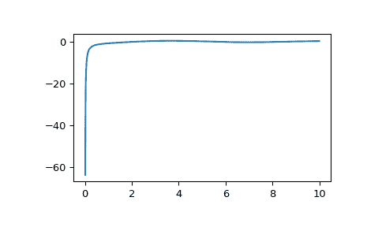

# `scipy.special.y1`

> 原文：[`docs.scipy.org/doc/scipy-1.12.0/reference/generated/scipy.special.y1.html#scipy.special.y1`](https://docs.scipy.org/doc/scipy-1.12.0/reference/generated/scipy.special.y1.html#scipy.special.y1)

```py
scipy.special.y1(x, out=None) = <ufunc 'y1'>
```

第二类贝塞尔函数，阶数为 1。

参数：

**x**array_like

参数（浮点数）。

**out**ndarray，可选

函数结果的可选输出数组

返回：

**Y**标量或 ndarray

在*x*处阶数为 1 的第二类贝塞尔函数值。

另请参阅

`j1`

第一类贝塞尔函数，阶数为 1

`yn`

第二类贝塞尔函数

`yv`

第二类贝塞尔函数

注意事项

域被分成区间[0, 8]和(8, 无穷大)。在第一个区间使用 25 项切比雪夫展开，计算\(J_1\)（第一类贝塞尔函数）是必需的。在第二个区间，使用两个 5/5 次有理函数的渐近三角函数表示。

此函数是 Cephes [[1]](#r928075cf13b2-1)例程的包装 `y1`。

参考资料

[1]

Cephes 数学函数库，[`www.netlib.org/cephes/`](http://www.netlib.org/cephes/)

示例

在一个点计算函数：

```py
>>> from scipy.special import y1
>>> y1(1.)
-0.7812128213002888 
```

在多个点计算：

```py
>>> import numpy as np
>>> y1(np.array([0.5, 2., 3.]))
array([-1.47147239, -0.10703243,  0.32467442]) 
```

绘制从 0 到 10 的函数图像。

```py
>>> import matplotlib.pyplot as plt
>>> fig, ax = plt.subplots()
>>> x = np.linspace(0., 10., 1000)
>>> y = y1(x)
>>> ax.plot(x, y)
>>> plt.show() 
```


