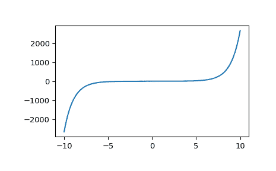

# `scipy.special.i1`

> 原文链接：[`docs.scipy.org/doc/scipy-1.12.0/reference/generated/scipy.special.i1.html#scipy.special.i1`](https://docs.scipy.org/doc/scipy-1.12.0/reference/generated/scipy.special.i1.html#scipy.special.i1)

```py
scipy.special.i1(x, out=None) = <ufunc 'i1'>
```

修改的一阶贝塞尔函数。

定义为，

\[I_1(x) = \frac{1}{2}x \sum_{k=0}^\infty \frac{(x²/4)^k}{k! (k + 1)!} = -\imath J_1(\imath x),\]

其中\(J_1\)是一阶贝塞尔函数的类型 1。

参数：

**x**array_like

参数（浮点数）

**out**ndarray，可选

函数值的可选输出数组

返回：

**I**标量或 ndarray

在*x*处的修改贝塞尔函数的值。

参见

`iv`

修改的一阶贝塞尔函数

`i1e`

指数缩放的修改的一阶贝塞尔函数

注释

范围被分为两个区间[0, 8]和(8, 无穷大)。在每个区间中使用切比雪夫多项式展开。

此函数是 Cephes 库[[1]](#r422edd5f3ab3-1)中`i1`例程的封装`i1`。

参考文献

[1]

Cephes 数学函数库，[`www.netlib.org/cephes/`](http://www.netlib.org/cephes/)

示例

计算一个点处的函数：

```py
>>> from scipy.special import i1
>>> i1(1.)
0.5651591039924851 
```

在多个点计算函数：

```py
>>> import numpy as np
>>> i1(np.array([-2., 0., 6.]))
array([-1.59063685,  0\.        , 61.34193678]) 
```

绘制函数在-10 到 10 之间的图像。

```py
>>> import matplotlib.pyplot as plt
>>> fig, ax = plt.subplots()
>>> x = np.linspace(-10., 10., 1000)
>>> y = i1(x)
>>> ax.plot(x, y)
>>> plt.show() 
```


