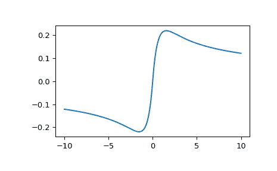

# `scipy.special.i1e`

> 原文链接：[`docs.scipy.org/doc/scipy-1.12.0/reference/generated/scipy.special.i1e.html#scipy.special.i1e`](https://docs.scipy.org/doc/scipy-1.12.0/reference/generated/scipy.special.i1e.html#scipy.special.i1e)

```py
scipy.special.i1e(x, out=None) = <ufunc 'i1e'>
```

指数级别修正贝塞尔函数的一阶函数。

定义如下：

```py
i1e(x) = exp(-abs(x)) * i1(x) 
```

参数：

**x**：array_like

参数（浮点数）

**out**：ndarray，可选

函数值的可选输出数组

返回：

**I**：标量或者 ndarray

指数级别修正贝塞尔函数的一阶函数在*x*处的值。

另请参见

`iv`

第一类修改贝塞尔函数

`i1`

一阶修改贝塞尔函数

注意

范围分为两个区间：[0, 8]和(8, 无穷大)。在每个区间中使用切比雪夫多项式展开。所使用的多项式展开与`i1`中的相同，但不会乘以主导的指数因子。

该函数是 Cephes 库[[1]](#r1da534a4770f-1)中的`i1e`例程的包装器。对于较大的参数*x*，`i1`会快速溢出，因此`i1e`非常有用。

参考资料

[1]

Cephes 数学函数库，[`www.netlib.org/cephes/`](http://www.netlib.org/cephes/)

示例

在以下示例中，`i1`返回无穷大，而`i1e`仍然返回有限数值。

```py
>>> from scipy.special import i1, i1e
>>> i1(1000.), i1e(1000.)
(inf, 0.01261093025692863) 
```

通过提供 NumPy 数组或列表来计算函数在多个点的值：

```py
>>> import numpy as np
>>> i1e(np.array([-2., 0., 6.]))
array([-0.21526929,  0\.        ,  0.15205146]) 
```

在-10 到 10 之间绘制函数图像。

```py
>>> import matplotlib.pyplot as plt
>>> fig, ax = plt.subplots()
>>> x = np.linspace(-10., 10., 1000)
>>> y = i1e(x)
>>> ax.plot(x, y)
>>> plt.show() 
```


