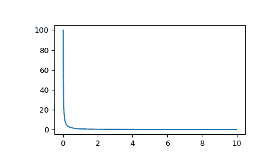

# `scipy.special.k1`

> 原文链接：[`docs.scipy.org/doc/scipy-1.12.0/reference/generated/scipy.special.k1.html#scipy.special.k1`](https://docs.scipy.org/doc/scipy-1.12.0/reference/generated/scipy.special.k1.html#scipy.special.k1)

```py
scipy.special.k1(x, out=None) = <ufunc 'k1'>
```

修正贝塞尔函数的第二类，阶数为 1，\(K_1(x)\)。

参数：

**x** 数组样式

参数（浮点数）

**out** 数组，可选

可选的输出数组，包含函数值

返回值：

**K** 标量或者数组

计算修正贝塞尔函数 K 的值，其阶数为 1，*x* 变量。

另见

`kv`

任意阶数的修正贝塞尔函数的第二类

`k1e`

指数尺度的修正贝塞尔函数 K，其阶数为 1

注意事项

范围分为两个区间 [0, 2] 和 (2, 无穷大)。在每个区间内采用切比雪夫多项式展开。

此函数是 Cephes [[1]](#r52a8e34738f7-1) 中的 `k1` 程序包装器。

参考文献

[1]

Cephes 数学函数库, [`www.netlib.org/cephes/`](http://www.netlib.org/cephes/)

示例

计算单个点的函数值：

```py
>>> from scipy.special import k1
>>> k1(1.)
0.6019072301972346 
```

计算多个点的函数值：

```py
>>> import numpy as np
>>> k1(np.array([0.5, 2., 3.]))
array([1.65644112, 0.13986588, 0.04015643]) 
```

绘制函数从 0 到 10 的图表。

```py
>>> import matplotlib.pyplot as plt
>>> fig, ax = plt.subplots()
>>> x = np.linspace(0., 10., 1000)
>>> y = k1(x)
>>> ax.plot(x, y)
>>> plt.show() 
```


