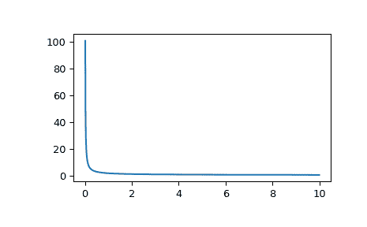

# `scipy.special.k1e`

> 原文链接：[`docs.scipy.org/doc/scipy-1.12.0/reference/generated/scipy.special.k1e.html#scipy.special.k1e`](https://docs.scipy.org/doc/scipy-1.12.0/reference/generated/scipy.special.k1e.html#scipy.special.k1e)

```py
scipy.special.k1e(x, out=None) = <ufunc 'k1e'>
```

指数尺度修正的贝塞尔函数 K 一阶

定义如下：

```py
k1e(x) = exp(x) * k1(x) 
```

参数：

**x**array_like

参数（浮点数）

**out**ndarray, 可选参数

可选的输出数组，用于函数值

返回：

**K**标量或 ndarray

指数尺度修正的贝塞尔函数 K 一阶在 *x* 处的值。

另见

`kv`

任意阶数的第二类修正贝塞尔函数

`k1`

一阶修正贝塞尔函数 K

注意事项

范围被分成两个区间 [0, 2] 和 (2, 无穷大)。每个区间使用切比雪夫多项式展开。

此函数是 Cephes [[1]](#rdc0ec9c3e6a2-1) 的 `k1e` 程序包装。

参考文献

[1]

Cephes 数学函数库，[`www.netlib.org/cephes/`](http://www.netlib.org/cephes/)

示例

在下面的例子中，`k1` 返回 0，而`k1e` 仍然返回一个有用的浮点数。

```py
>>> from scipy.special import k1, k1e
>>> k1(1000.), k1e(1000.)
(0., 0.03964813081296021) 
```

通过提供一个 NumPy 数组或列表来在多个点计算函数的值：

```py
>>> import numpy as np
>>> k1e(np.array([0.5, 2., 3.]))
array([2.73100971, 1.03347685, 0.80656348]) 
```

绘制函数从 0 到 10。

```py
>>> import matplotlib.pyplot as plt
>>> fig, ax = plt.subplots()
>>> x = np.linspace(0., 10., 1000)
>>> y = k1e(x)
>>> ax.plot(x, y)
>>> plt.show() 
```


