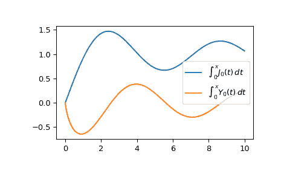

# `scipy.special.itj0y0`

> 原文：[`docs.scipy.org/doc/scipy-1.12.0/reference/generated/scipy.special.itj0y0.html#scipy.special.itj0y0`](https://docs.scipy.org/doc/scipy-1.12.0/reference/generated/scipy.special.itj0y0.html#scipy.special.itj0y0)

```py
scipy.special.itj0y0(x, out=None) = <ufunc 'itj0y0'>
```

一阶贝塞尔函数积分。

计算积分

\[\begin{split}\int_0^x J_0(t) dt \\ \int_0^x Y_0(t) dt.\end{split}\]

关于 \(J_0\) 和 \(Y_0\) 的更多信息请参见`j0` 和 `y0`。

参数：

**x**array_like

评估积分的值点。

**out**ndarray 或者 tuple，可选

函数结果的可选输出数组。

返回：

**ij0**标量或者 ndarray

`j0`的积分

**iy0**标量或者 ndarray

`y0`的积分

参考文献

[1]

S. Zhang 和 J.M. Jin，“特殊函数的计算”，Wiley 1996

示例

在一个点评估函数。

```py
>>> from scipy.special import itj0y0
>>> int_j, int_y = itj0y0(1.)
>>> int_j, int_y
(0.9197304100897596, -0.637069376607422) 
```

在几个点评估函数。

```py
>>> import numpy as np
>>> points = np.array([0., 1.5, 3.])
>>> int_j, int_y = itj0y0(points)
>>> int_j, int_y
(array([0\.        , 1.24144951, 1.38756725]),
 array([ 0\.        , -0.51175903,  0.19765826])) 
```

从 0 到 10 绘制函数。

```py
>>> import matplotlib.pyplot as plt
>>> fig, ax = plt.subplots()
>>> x = np.linspace(0., 10., 1000)
>>> int_j, int_y = itj0y0(x)
>>> ax.plot(x, int_j, label="$\int_0^x J_0(t)\,dt$")
>>> ax.plot(x, int_y, label="$\int_0^x Y_0(t)\,dt$")
>>> ax.legend()
>>> plt.show() 
```


