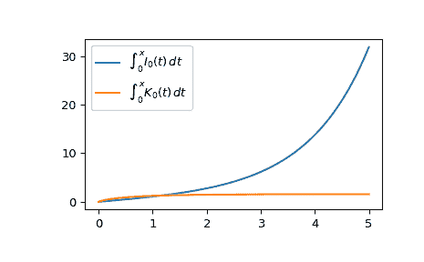

# `scipy.special.iti0k0`

> 原文链接：[`docs.scipy.org/doc/scipy-1.12.0/reference/generated/scipy.special.iti0k0.html#scipy.special.iti0k0`](https://docs.scipy.org/doc/scipy-1.12.0/reference/generated/scipy.special.iti0k0.html#scipy.special.iti0k0)

```py
scipy.special.iti0k0(x, out=None) = <ufunc 'iti0k0'>
```

修改 Bessel 函数零阶的积分。

计算积分

\[\begin{split}\int_0^x I_0(t) dt \\ \int_0^x K_0(t) dt.\end{split}\]

关于\(I_0\)和\(K_0\)的更多信息，请参见[`i0`](https://docs.scipy.org/doc/scipy-1.12.0/reference/generated/scipy.special.i0.html#scipy.special.i0 "scipy.special.i0")和[`k0`](https://docs.scipy.org/doc/scipy-1.12.0/reference/generated/scipy.special.k0.html#scipy.special.k0 "scipy.special.k0")。

参数：

**x**array_like

评估积分的值。

**out**ndarrays 的元组，可选

用于函数结果的可选输出数组。

返回：

**ii0**标量或 ndarray

[`i0`](https://docs.scipy.org/doc/scipy-1.12.0/reference/generated/scipy.special.i0.html#scipy.special.i0 "scipy.special.i0")的积分

**ik0**标量或 ndarray

[`k0`](https://docs.scipy.org/doc/scipy-1.12.0/reference/generated/scipy.special.k0.html#scipy.special.k0 "scipy.special.k0")的积分

参考资料

[1]

S. Zhang 和 J.M. Jin，“特殊函数的计算”，Wiley 1996

示例

在一个点评估函数。

```py
>>> from scipy.special import iti0k0
>>> int_i, int_k = iti0k0(1.)
>>> int_i, int_k
(1.0865210970235892, 1.2425098486237771) 
```

在几个点评估函数。

```py
>>> import numpy as np
>>> points = np.array([0., 1.5, 3.])
>>> int_i, int_k = iti0k0(points)
>>> int_i, int_k
(array([0\.        , 1.80606937, 6.16096149]),
 array([0\.        , 1.39458246, 1.53994809])) 
```

从 0 到 5 绘制函数。

```py
>>> import matplotlib.pyplot as plt
>>> fig, ax = plt.subplots()
>>> x = np.linspace(0., 5., 1000)
>>> int_i, int_k = iti0k0(x)
>>> ax.plot(x, int_i, label="$\int_0^x I_0(t)\,dt$")
>>> ax.plot(x, int_k, label="$\int_0^x K_0(t)\,dt$")
>>> ax.legend()
>>> plt.show() 
```


