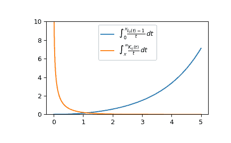

# `scipy.special.it2i0k0`

> 原文：[`docs.scipy.org/doc/scipy-1.12.0/reference/generated/scipy.special.it2i0k0.html#scipy.special.it2i0k0`](https://docs.scipy.org/doc/scipy-1.12.0/reference/generated/scipy.special.it2i0k0.html#scipy.special.it2i0k0)

```py
scipy.special.it2i0k0(x, out=None) = <ufunc 'it2i0k0'>
```

与修改的贝塞尔函数的积分有关。

计算积分

\[\begin{split}\int_0^x \frac{I_0(t) - 1}{t} dt \\ \int_x^\infty \frac{K_0(t)}{t} dt.\end{split}\]

参数：

**x**类似数组

评估积分的值。

**out**ndarrays 的元组，可选的

函数结果的可选输出数组。

返回：

**ii0**标量或 ndarray

对于[`i0`](https://docs.scipy.org/doc/scipy-1.12.0/reference/generated/scipy.special.i0.html#scipy.special.i0 "scipy.special.i0")的积分

**ik0**标量或 ndarray

对于[`k0`](https://docs.scipy.org/doc/scipy-1.12.0/reference/generated/scipy.special.k0.html#scipy.special.k0 "scipy.special.k0")的积分

参考文献

[1]

S. Zhang 和 J.M. Jin，《特殊函数的计算》，Wiley 1996

示例

在一个点评估函数。

```py
>>> from scipy.special import it2i0k0
>>> int_i, int_k = it2i0k0(1.)
>>> int_i, int_k
(0.12897944249456852, 0.2085182909001295) 
```

在几个点评估函数。

```py
>>> import numpy as np
>>> points = np.array([0.5, 1.5, 3.])
>>> int_i, int_k = it2i0k0(points)
>>> int_i, int_k
(array([0.03149527, 0.30187149, 1.50012461]),
 array([0.66575102, 0.0823715 , 0.00823631])) 
```

绘制从 0 到 5 的函数。

```py
>>> import matplotlib.pyplot as plt
>>> fig, ax = plt.subplots()
>>> x = np.linspace(0., 5., 1000)
>>> int_i, int_k = it2i0k0(x)
>>> ax.plot(x, int_i, label=r"$\int_0^x \frac{I_0(t)-1}{t}\,dt$")
>>> ax.plot(x, int_k, label=r"$\int_x^{\infty} \frac{K_0(t)}{t}\,dt$")
>>> ax.legend()
>>> ax.set_ylim(0, 10)
>>> plt.show() 
```


