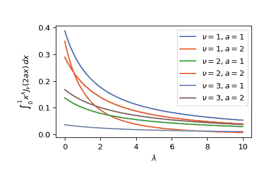

# `scipy.special.besselpoly`

> 原文：[`docs.scipy.org/doc/scipy-1.12.0/reference/generated/scipy.special.besselpoly.html#scipy.special.besselpoly`](https://docs.scipy.org/doc/scipy-1.12.0/reference/generated/scipy.special.besselpoly.html#scipy.special.besselpoly)

```py
scipy.special.besselpoly(a, lmb, nu, out=None) = <ufunc 'besselpoly'>
```

第一类贝塞尔函数的加权积分。

计算

\[\int_0¹ x^\lambda J_\nu(2 a x) \, dx\]

这里的\(J_\nu\)是贝塞尔函数，\(\lambda=lmb\), \(\nu=nu\)。

参数：

**a**类似数组

贝塞尔函数内的比例因子。

**lmb**类似数组

*x*的幂

**nu**类似数组

贝塞尔函数的阶数。

**out**ndarray，可选

函数结果的可选输出数组。

返回：

标量或者 ndarray

积分的值。

参考资料

[1]

Cephes 数学函数库，[`www.netlib.org/cephes/`](http://www.netlib.org/cephes/)

示例

为一个参数集评估函数。

```py
>>> from scipy.special import besselpoly
>>> besselpoly(1, 1, 1)
0.24449718372863877 
```

评估不同比例因子下的函数。

```py
>>> import numpy as np
>>> factors = np.array([0., 3., 6.])
>>> besselpoly(factors, 1, 1)
array([ 0\.        , -0.00549029,  0.00140174]) 
```

绘制不同幂次、阶数和比例尺度的函数图像。

```py
>>> import matplotlib.pyplot as plt
>>> fig, ax = plt.subplots()
>>> powers = np.linspace(0, 10, 100)
>>> orders = [1, 2, 3]
>>> scales = [1, 2]
>>> all_combinations = [(order, scale) for order in orders
...                     for scale in scales]
>>> for order, scale in all_combinations:
...     ax.plot(powers, besselpoly(scale, powers, order),
...             label=rf"$\nu={order}, a={scale}$")
>>> ax.legend()
>>> ax.set_xlabel(r"$\lambda$")
>>> ax.set_ylabel(r"$\int_0¹ x^{\lambda} J_{\nu}(2ax)\,dx$")
>>> plt.show() 
```


