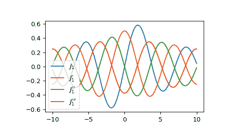

# `scipy.special.jvp`

> 原文链接：[`docs.scipy.org/doc/scipy-1.12.0/reference/generated/scipy.special.jvp.html#scipy.special.jvp`](https://docs.scipy.org/doc/scipy-1.12.0/reference/generated/scipy.special.jvp.html#scipy.special.jvp)

```py
scipy.special.jvp(v, z, n=1)
```

计算一阶类贝塞尔函数的导数。

计算贝塞尔函数 *Jv* 关于 *z* 的第 n 阶导数。

参数：

**v**数组或浮点数

贝塞尔函数的阶数

**z**复数

要评估导数的参数；可以是实数或复数。

**n**int，默认为 1

导数的阶数。对于 0 返回贝塞尔函数`jv`本身。

返回：

标量或 ndarray

贝塞尔函数导数的值。

注释

使用关系 DLFM 10.6.7 计算导数 [[2]](#r22310241ac5e-2)。

参考文献

[1]

Zhang, Shanjie 和 Jin, Jianming. “Special Functions 的计算”, John Wiley and Sons, 1996, 第五章。[`people.sc.fsu.edu/~jburkardt/f77_src/special_functions/special_functions.html`](https://people.sc.fsu.edu/~jburkardt/f77_src/special_functions/special_functions.html)

[2]

NIST 数学函数数字图书馆。[`dlmf.nist.gov/10.6.E7`](https://dlmf.nist.gov/10.6.E7)

示例

计算阶数为 0 时一阶类贝塞尔函数及其前两阶导数在 1 处的值。

```py
>>> from scipy.special import jvp
>>> jvp(0, 1, 0), jvp(0, 1, 1), jvp(0, 1, 2)
(0.7651976865579666, -0.44005058574493355, -0.3251471008130331) 
```

提供一个数组作为 *v* 来计算一阶类贝塞尔函数在 1 处的多个阶数的第一阶导数。

```py
>>> jvp([0, 1, 2], 1, 1)
array([-0.44005059,  0.3251471 ,  0.21024362]) 
```

提供一个数组作为 *z* 来计算一阶类贝塞尔函数阶数为 0 时在多个点处的第一阶导数。

```py
>>> import numpy as np
>>> points = np.array([0., 1.5, 3.])
>>> jvp(0, points, 1)
array([-0\.        , -0.55793651, -0.33905896]) 
```

绘制一阶类贝塞尔函数及其前三阶导数。

```py
>>> import matplotlib.pyplot as plt
>>> x = np.linspace(-10, 10, 1000)
>>> fig, ax = plt.subplots()
>>> ax.plot(x, jvp(1, x, 0), label=r"$J_1$")
>>> ax.plot(x, jvp(1, x, 1), label=r"$J_1'$")
>>> ax.plot(x, jvp(1, x, 2), label=r"$J_1''$")
>>> ax.plot(x, jvp(1, x, 3), label=r"$J_1'''$")
>>> plt.legend()
>>> plt.show() 
```


