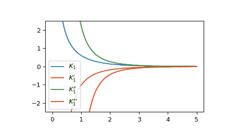

# `scipy.special.kvp`

> 原文：[`docs.scipy.org/doc/scipy-1.12.0/reference/generated/scipy.special.kvp.html#scipy.special.kvp`](https://docs.scipy.org/doc/scipy-1.12.0/reference/generated/scipy.special.kvp.html#scipy.special.kvp)

```py
scipy.special.kvp(v, z, n=1)
```

计算实数阶修正贝塞尔函数 Kv(z)的导数

Kv(z)是第二类修正贝塞尔函数。导数是相对于*z*计算的。

参数：

**v**浮点数数组

贝塞尔函数的阶数

**z**复数数组

计算导数的论点

**n**整数，默认为 1

导数的阶数。对于 0，返回贝塞尔函数[`kv`](https://docs.scipy.org/doc/scipy-1.12.0/reference/generated/scipy.special.kvp.html#scipy.special.kvp "scipy.special.kvp")本身。

返回值：

**out**ndarray

结果

另见

[`kv`](https://docs.scipy.org/doc/scipy-1.12.0/reference/generated/scipy.special.kvp.html#scipy.special.kvp "scipy.special.kvp")

注释

使用关系 DLFM 10.29.5 计算导数[[2]](#r8a50544855b1-2)。

参考文献

[1]

张善杰和金建明。“特殊函数的计算”，约翰威利和儿子，1996 年，第六章。[`people.sc.fsu.edu/~jburkardt/f77_src/special_functions/special_functions.html`](https://people.sc.fsu.edu/~jburkardt/f77_src/special_functions/special_functions.html)

[2]

NIST 数学函数数字库。[`dlmf.nist.gov/10.29.E5`](https://dlmf.nist.gov/10.29.E5)

示例

在 1 处计算第二类修正贝塞尔函数及其前两个导数的阶数。

```py
>>> from scipy.special import kvp
>>> kvp(0, 1, 0), kvp(0, 1, 1), kvp(0, 1, 2)
(0.42102443824070834, -0.6019072301972346, 1.0229316684379428) 
```

通过为*v*提供一个数组，在 1 处计算几个阶数的第二类修正贝塞尔函数的一阶导数。

```py
>>> kvp([0, 1, 2], 1, 1)
array([-0.60190723, -1.02293167, -3.85158503]) 
```

通过为*z*提供一个数组，计算几个点的第二类修正贝塞尔函数的一阶导数，其中*z*是浮点数的数组。

```py
>>> import numpy as np
>>> points = np.array([0.5, 1.5, 3.])
>>> kvp(0, points, 1)
array([-1.65644112, -0.2773878 , -0.04015643]) 
```

绘制第二类修正贝塞尔函数及其前三个导数。

```py
>>> import matplotlib.pyplot as plt
>>> x = np.linspace(0, 5, 1000)
>>> fig, ax = plt.subplots()
>>> ax.plot(x, kvp(1, x, 0), label=r"$K_1$")
>>> ax.plot(x, kvp(1, x, 1), label=r"$K_1'$")
>>> ax.plot(x, kvp(1, x, 2), label=r"$K_1''$")
>>> ax.plot(x, kvp(1, x, 3), label=r"$K_1'''$")
>>> ax.set_ylim(-2.5, 2.5)
>>> plt.legend()
>>> plt.show() 
```


