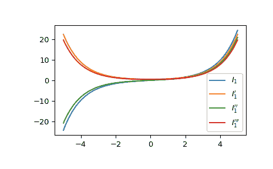

# `scipy.special.ivp`

> 原文：[`docs.scipy.org/doc/scipy-1.12.0/reference/generated/scipy.special.ivp.html#scipy.special.ivp`](https://docs.scipy.org/doc/scipy-1.12.0/reference/generated/scipy.special.ivp.html#scipy.special.ivp)

```py
scipy.special.ivp(v, z, n=1)
```

计算一类修正贝塞尔函数的导数。

计算一类修正贝塞尔函数*Iv*关于*z*的第 n 阶导数。

参数：

**v**array_like 或 float

贝塞尔函数的阶数

**z**array_like

用于计算导数的参数；可以是实数或复数。

**n**int，默认值 1

导数的阶数。对于 0，返回贝塞尔函数`iv`本身。

返回：

标量或 ndarray

修正贝塞尔函数的第 n 阶导数。

另请参阅

`iv`

注释

使用关系 DLFM 10.29.5 计算导数[[2]](#r40280dc1eb18-2)。

参考文献

[1]

张善杰和金建明。“特殊函数的计算”，John Wiley and Sons，1996 年，第六章。[`people.sc.fsu.edu/~jburkardt/f77_src/special_functions/special_functions.html`](https://people.sc.fsu.edu/~jburkardt/f77_src/special_functions/special_functions.html)

[2]

NIST 数学函数数字图书馆。[`dlmf.nist.gov/10.29.E5`](https://dlmf.nist.gov/10.29.E5)

示例

计算一类修正贝塞尔函数的一阶导数为 0 阶和其在 1 处的前两个导数。

```py
>>> from scipy.special import ivp
>>> ivp(0, 1, 0), ivp(0, 1, 1), ivp(0, 1, 2)
(1.2660658777520084, 0.565159103992485, 0.7009067737595233) 
```

通过为*v*提供数组，计算一类修正贝塞尔函数的一阶导数的多个阶在 1 处的值。

```py
>>> ivp([0, 1, 2], 1, 1)
array([0.5651591 , 0.70090677, 0.29366376]) 
```

通过为*z*提供数组，计算一类修正贝塞尔函数的一阶导数为 0 阶在几个点处的值。

```py
>>> import numpy as np
>>> points = np.array([0., 1.5, 3.])
>>> ivp(0, points, 1)
array([0\.        , 0.98166643, 3.95337022]) 
```

绘制一类修正贝塞尔函数的一阶导数为 1 阶及其前三阶导数。

```py
>>> import matplotlib.pyplot as plt
>>> x = np.linspace(-5, 5, 1000)
>>> fig, ax = plt.subplots()
>>> ax.plot(x, ivp(1, x, 0), label=r"$I_1$")
>>> ax.plot(x, ivp(1, x, 1), label=r"$I_1'$")
>>> ax.plot(x, ivp(1, x, 2), label=r"$I_1''$")
>>> ax.plot(x, ivp(1, x, 3), label=r"$I_1'''$")
>>> plt.legend()
>>> plt.show() 
```


