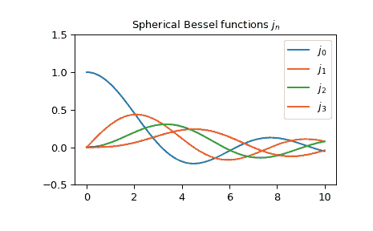

# `scipy.special.spherical_jn`

> 原文：[`docs.scipy.org/doc/scipy-1.12.0/reference/generated/scipy.special.spherical_jn.html#scipy.special.spherical_jn`](https://docs.scipy.org/doc/scipy-1.12.0/reference/generated/scipy.special.spherical_jn.html#scipy.special.spherical_jn)

```py
scipy.special.spherical_jn(n, z, derivative=False)
```

第一类球贝塞尔函数或其导数。

定义为[[1]](#r1a410864550e-1),

\[j_n(z) = \sqrt{\frac{\pi}{2z}} J_{n + 1/2}(z),\]

其中\(J_n\)是第一类贝塞尔函数。

参数：

**n**int，类数组

Bessel 函数的顺序（n >= 0）。

**z**复数或浮点数，类数组

贝塞尔函数的参数。

**derivative**bool，可选

如果为 True，则返回导数值（而不是函数本身）。

返回：

**jn**ndarray

注意事项

对于大于顺序的实数参数，使用升序递推计算函数[[2]](#r1a410864550e-2)。对于小的实数或复数参数，使用与第一类圆柱贝塞尔函数的定义关系。

使用关系计算导数[[3]](#r1a410864550e-3)，

\[ \begin{align}\begin{aligned}j_n'(z) = j_{n-1}(z) - \frac{n + 1}{z} j_n(z).\\j_0'(z) = -j_1(z)\end{aligned}\end{align} \]

自 0.18.0 版本起新增。

参考文献

[1]

[`dlmf.nist.gov/10.47.E3`](https://dlmf.nist.gov/10.47.E3)

[2]

[`dlmf.nist.gov/10.51.E1`](https://dlmf.nist.gov/10.51.E1)

[3]

[`dlmf.nist.gov/10.51.E2`](https://dlmf.nist.gov/10.51.E2)

[AS]

米尔顿·阿布拉莫维茨和艾琳·A·斯特甘（Milton Abramowitz and Irene A. Stegun）主编。数学函数手册，包含公式、图表和数学表格。纽约：多佛出版社，1972 年。

示例

第一类球贝塞尔函数\(j_n\)接受实数和复数第二参数。它们可以返回复数类型：

```py
>>> from scipy.special import spherical_jn
>>> spherical_jn(0, 3+5j)
(-9.878987731663194-8.021894345786002j)
>>> type(spherical_jn(0, 3+5j))
<class 'numpy.complex128'> 
```

我们可以验证在区间\([1, 2]\)中的\(n=3\)的导数关系：

```py
>>> import numpy as np
>>> x = np.arange(1.0, 2.0, 0.01)
>>> np.allclose(spherical_jn(3, x, True),
...             spherical_jn(2, x) - 4/x * spherical_jn(3, x))
True 
```

几个具有实数参数的\(j_n\)：

```py
>>> import matplotlib.pyplot as plt
>>> x = np.arange(0.0, 10.0, 0.01)
>>> fig, ax = plt.subplots()
>>> ax.set_ylim(-0.5, 1.5)
>>> ax.set_title(r'Spherical Bessel functions $j_n$')
>>> for n in np.arange(0, 4):
...     ax.plot(x, spherical_jn(n, x), label=rf'$j_{n}$')
>>> plt.legend(loc='best')
>>> plt.show() 
```


