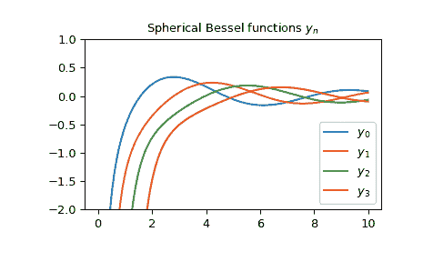

# `scipy.special.spherical_yn`

> 原文：[`docs.scipy.org/doc/scipy-1.12.0/reference/generated/scipy.special.spherical_yn.html#scipy.special.spherical_yn`](https://docs.scipy.org/doc/scipy-1.12.0/reference/generated/scipy.special.spherical_yn.html#scipy.special.spherical_yn)

```py
scipy.special.spherical_yn(n, z, derivative=False)
```

第二类球贝塞尔函数或其导数。

定义如[[1]](#rb8f745322909-1)，

\[y_n(z) = \sqrt{\frac{\pi}{2z}} Y_{n + 1/2}(z),\]

其中\(Y_n\)是第二类贝塞尔函数。

参数：

**n**整数，类数组

**贝塞尔函数的阶数（n >= 0）。**

**z**复数或浮点数，类数组

**贝塞尔函数的自变量。**

**derivative**布尔值，可选项

如果为 True，则返回导数值（而不是函数本身）。

返回：

**yn**ndarray

**注释**

对于实数自变量，使用递增的递推计算函数[[2]](#rb8f745322909-2)。对于复数自变量，使用与第二类圆柱贝塞尔函数的定义关系。

使用关系计算导数[[3]](#rb8f745322909-3)。

\[ \begin{align}\begin{aligned}y_n' = y_{n-1} - \frac{n + 1}{z} y_n.\\y_0' = -y_1\end{aligned}\end{align} \]

新功能版本 0.18.0。

**参考文献**

[1]

[`dlmf.nist.gov/10.47.E4`](https://dlmf.nist.gov/10.47.E4)

[2]

[`dlmf.nist.gov/10.51.E1`](https://dlmf.nist.gov/10.51.E1)

[3]

[`dlmf.nist.gov/10.51.E2`](https://dlmf.nist.gov/10.51.E2)

[AS]

米尔顿·阿布拉莫维奇和艾琳·A·斯特根（Milton Abramowitz and Irene A. Stegun）编辑。数学函数手册：带有公式、图表和数学表格。纽约：多佛尔出版社，1972 年。

例子

第二类球贝塞尔函数\(y_n\)接受实数和复数作为第二个自变量。它们可以返回复数类型：

```py
>>> from scipy.special import spherical_yn
>>> spherical_yn(0, 3+5j)
(8.022343088587197-9.880052589376795j)
>>> type(spherical_yn(0, 3+5j))
<class 'numpy.complex128'> 
```

我们可以验证关于导数的关系，从\(n=3\)的注释中，在区间\([1, 2]\)内：

```py
>>> import numpy as np
>>> x = np.arange(1.0, 2.0, 0.01)
>>> np.allclose(spherical_yn(3, x, True),
...             spherical_yn(2, x) - 4/x * spherical_yn(3, x))
True 
```

带有实数自变量的前几个\(y_n\)：

```py
>>> import matplotlib.pyplot as plt
>>> x = np.arange(0.0, 10.0, 0.01)
>>> fig, ax = plt.subplots()
>>> ax.set_ylim(-2.0, 1.0)
>>> ax.set_title(r'Spherical Bessel functions $y_n$')
>>> for n in np.arange(0, 4):
...     ax.plot(x, spherical_yn(n, x), label=rf'$y_{n}$')
>>> plt.legend(loc='best')
>>> plt.show() 
```


