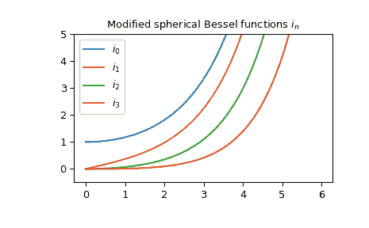

# `scipy.special.spherical_in`

> 原文链接：[`docs.scipy.org/doc/scipy-1.12.0/reference/generated/scipy.special.spherical_in.html#scipy.special.spherical_in`](https://docs.scipy.org/doc/scipy-1.12.0/reference/generated/scipy.special.spherical_in.html#scipy.special.spherical_in)

```py
scipy.special.spherical_in(n, z, derivative=False)
```

修改后的第一类球面贝塞尔函数或其导数。

定义如下 [[1]](#re08d1dbcac5f-1),

\[i_n(z) = \sqrt{\frac{\pi}{2z}} I_{n + 1/2}(z),\]

其中 \(I_n\) 是修改后的第一类圆柱贝塞尔函数。

参数:

**n**int, array_like

贝塞尔函数的阶数 (n >= 0)。

**z**复数或浮点数，array_like

贝塞尔函数的自变量。

**derivative**布尔值，可选

如果为 True，则返回导数值（而非函数本身）。

返回:

**in**ndarray

注意事项

使用其与修改后的第一类圆柱贝塞尔函数的定义关系来计算函数。

使用关系计算导数 [[2]](#re08d1dbcac5f-2),

\[ \begin{align}\begin{aligned}i_n' = i_{n-1} - \frac{n + 1}{z} i_n.\\i_1' = i_0\end{aligned}\end{align} \]

自 0.18.0 版本起新增。

参考文献

[1]

[`dlmf.nist.gov/10.47.E7`](https://dlmf.nist.gov/10.47.E7)

[2]

[`dlmf.nist.gov/10.51.E5`](https://dlmf.nist.gov/10.51.E5)

[AS]

Milton Abramowitz 和 Irene A. Stegun 编辑。Handbook of Mathematical Functions with Formulas, Graphs, and Mathematical Tables. 纽约：Dover，1972 年。

示例

修改后的第一类球面贝塞尔函数 \(i_n\) 接受实数和复数第二个参数。它们可以返回复数类型：

```py
>>> from scipy.special import spherical_in
>>> spherical_in(0, 3+5j)
(-1.1689867793369182-1.2697305267234222j)
>>> type(spherical_in(0, 3+5j))
<class 'numpy.complex128'> 
```

我们可以验证在区间 \([1, 2]\) 内 \(n=3\) 时，从注释中得到的导数关系：

```py
>>> import numpy as np
>>> x = np.arange(1.0, 2.0, 0.01)
>>> np.allclose(spherical_in(3, x, True),
...             spherical_in(2, x) - 4/x * spherical_in(3, x))
True 
```

前几个具有实数参数的 \(i_n\)：

```py
>>> import matplotlib.pyplot as plt
>>> x = np.arange(0.0, 6.0, 0.01)
>>> fig, ax = plt.subplots()
>>> ax.set_ylim(-0.5, 5.0)
>>> ax.set_title(r'Modified spherical Bessel functions $i_n$')
>>> for n in np.arange(0, 4):
...     ax.plot(x, spherical_in(n, x), label=rf'$i_{n}$')
>>> plt.legend(loc='best')
>>> plt.show() 
```


