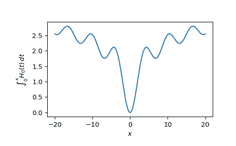

# `scipy.special.itstruve0`

> 原文链接：[`docs.scipy.org/doc/scipy-1.12.0/reference/generated/scipy.special.itstruve0.html#scipy.special.itstruve0`](https://docs.scipy.org/doc/scipy-1.12.0/reference/generated/scipy.special.itstruve0.html#scipy.special.itstruve0)

```py
scipy.special.itstruve0(x, out=None) = <ufunc 'itstruve0'>
```

零阶斯特鲁夫函数的积分。

\[I = \int_0^x H_0(t)\,dt\]

参数：

**x**array_like

积分上限（浮点数）。

**out**ndarray，可选

函数值的可选输出数组

返回：

**I**标量或 ndarray

从 0 到*x*的\[H_0\]的积分。

另请参见

[`struve`](https://docs.scipy.org/doc/scipy-1.12.0/reference/generated/scipy.special.struve.html#scipy.special.struve "scipy.special.struve")

由此函数积分的函数。

注：

由张善杰和金建明创建的 Fortran 例程的包装器[[1]](#r6c3ec6a97833-1)。

参考文献

[1]

Zhang, Shanjie and Jin, Jianming. “Computation of Special Functions”, John Wiley and Sons, 1996. [`people.sc.fsu.edu/~jburkardt/f_src/special_functions/special_functions.html`](https://people.sc.fsu.edu/~jburkardt/f_src/special_functions/special_functions.html)

示例

在一个点上评估函数。

```py
>>> import numpy as np
>>> from scipy.special import itstruve0
>>> itstruve0(1.)
0.30109042670805547 
```

通过为*x*提供一个数组，在多个点上评估函数。

```py
>>> points = np.array([1., 2., 3.5])
>>> itstruve0(points)
array([0.30109043, 1.01870116, 1.96804581]) 
```

绘制从-20 到 20 的函数。

```py
>>> import matplotlib.pyplot as plt
>>> x = np.linspace(-20., 20., 1000)
>>> istruve0_values = itstruve0(x)
>>> fig, ax = plt.subplots()
>>> ax.plot(x, istruve0_values)
>>> ax.set_xlabel(r'$x$')
>>> ax.set_ylabel(r'$\int_0^{x}H_0(t)\,dt$')
>>> plt.show() 
```


