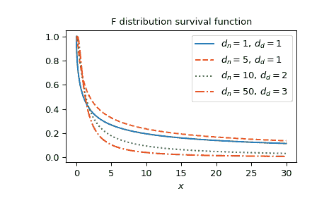

# `scipy.special.fdtrc`

> 原文：[`docs.scipy.org/doc/scipy-1.12.0/reference/generated/scipy.special.fdtrc.html#scipy.special.fdtrc`](https://docs.scipy.org/doc/scipy-1.12.0/reference/generated/scipy.special.fdtrc.html#scipy.special.fdtrc)

```py
scipy.special.fdtrc(dfn, dfd, x, out=None) = <ufunc 'fdtrc'>
```

F 生存函数。

返回补充 F 分布函数（从 *x* 到无穷的密度积分）。

参数：

**dfn** array_like

第一个参数（正浮点数）。

**dfd** array_like

第二个参数（正浮点数）。

**x** array_like

参数（非负浮点数）。

**out** ndarray，可选

函数值的可选输出数组

返回：

**y** 标量或者 ndarray

补充 F 分布函数，带有参数 *dfn* 和 *dfd* 在 *x* 处。

另请参阅

[`fdtr`](https://docs.scipy.org/doc/scipy-1.12.0/reference/generated/scipy.special.fdtr.html#scipy.special.fdtr "scipy.special.fdtr")

F 分布的累积分布函数

[`fdtri`](https://docs.scipy.org/doc/scipy-1.12.0/reference/generated/scipy.special.fdtri.html#scipy.special.fdtri "scipy.special.fdtri")

F 分布的逆累积分布函数

[`scipy.stats.f`](https://docs.scipy.org/doc/scipy-1.12.0/reference/generated/scipy.stats.f.html#scipy.stats.f "scipy.stats.f")

F 分布

注意

根据公式使用常规不完全 Beta 函数，

\[F(d_n, d_d; x) = I_{d_d/(d_d + xd_n)}(d_d/2, d_n/2).\]

Cephes 的包装器[[1]](#r192ef81d51c2-1)，使用 Cephes 中的 `fdtrc` 程序。F 分布也可作为 [`scipy.stats.f`](https://docs.scipy.org/doc/scipy-1.12.0/reference/generated/scipy.stats.f.html#scipy.stats.f "scipy.stats.f") 调用。直接调用 `fdtrc` 可以提高性能，与 [`scipy.stats.f`](https://docs.scipy.org/doc/scipy-1.12.0/reference/generated/scipy.stats.f.html#scipy.stats.f "scipy.stats.f") 的 `sf` 方法相比（请参阅下面的最后一个示例）。

参考文献

[1]

Cephes 数学函数库，[`www.netlib.org/cephes/`](http://www.netlib.org/cephes/)

示例

计算`dfn=1`和`dfd=2`在`x=1`时的函数。

```py
>>> import numpy as np
>>> from scipy.special import fdtrc
>>> fdtrc(1, 2, 1)
0.42264973081037427 
```

通过为 *x* 提供 NumPy 数组在几个点上计算函数。

```py
>>> x = np.array([0.5, 2., 3.])
>>> fdtrc(1, 2, x)
array([0.5527864 , 0.29289322, 0.22540333]) 
```

绘制几个参数集的函数。

```py
>>> import matplotlib.pyplot as plt
>>> dfn_parameters = [1, 5, 10, 50]
>>> dfd_parameters = [1, 1, 2, 3]
>>> linestyles = ['solid', 'dashed', 'dotted', 'dashdot']
>>> parameters_list = list(zip(dfn_parameters, dfd_parameters,
...                            linestyles))
>>> x = np.linspace(0, 30, 1000)
>>> fig, ax = plt.subplots()
>>> for parameter_set in parameters_list:
...     dfn, dfd, style = parameter_set
...     fdtrc_vals = fdtrc(dfn, dfd, x)
...     ax.plot(x, fdtrc_vals, label=rf"$d_n={dfn},\, d_d={dfd}$",
...             ls=style)
>>> ax.legend()
>>> ax.set_xlabel("$x$")
>>> ax.set_title("F distribution survival function")
>>> plt.show() 
```



F 分布也可作为 [`scipy.stats.f`](https://docs.scipy.org/doc/scipy-1.12.0/reference/generated/scipy.stats.f.html#scipy.stats.f "scipy.stats.f") 调用。直接使用 `fdtrc` 可比调用 [`scipy.stats.f`](https://docs.scipy.org/doc/scipy-1.12.0/reference/generated/scipy.stats.f.html#scipy.stats.f "scipy.stats.f") 的 `sf` 方法更快，特别是对于小数组或单个值。为了获得相同的结果，必须使用以下参数化方式：`stats.f(dfn, dfd).sf(x)=fdtrc(dfn, dfd, x)`。

```py
>>> from scipy.stats import f
>>> dfn, dfd = 1, 2
>>> x = 1
>>> fdtrc_res = fdtrc(dfn, dfd, x)  # this will often be faster than below
>>> f_dist_res = f(dfn, dfd).sf(x)
>>> f_dist_res == fdtrc_res  # test that results are equal
True 
```
