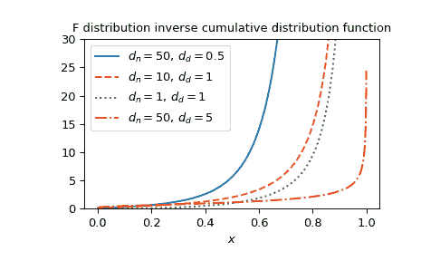

# `scipy.special.fdtri`

> 原文：[`docs.scipy.org/doc/scipy-1.12.0/reference/generated/scipy.special.fdtri.html#scipy.special.fdtri`](https://docs.scipy.org/doc/scipy-1.12.0/reference/generated/scipy.special.fdtri.html#scipy.special.fdtri)

```py
scipy.special.fdtri(dfn, dfd, p, out=None) = <ufunc 'fdtri'>
```

F 分布的*p*-th 分位数。

该函数是 F 分布 CDF 的逆函数，`fdtr`，返回*x*，使得*fdtr(dfn, dfd, x) = p*。

参数：

**dfn**类似数组

第一个参数（正浮点数）。

**dfd**类似数组

第二个参数（正浮点数）。

**p**类似数组

累积概率，在[0, 1]区间内。

**out** ndarray，可选

函数值的可选输出数组

返回：

**x**标量或 ndarray

*p*对应的分位数。

另请参见

`fdtr`

F 分布累积分布函数

`fdtrc`

F 分布生存函数

`scipy.stats.f`

F 分布

注意事项

计算是通过与逆正则化贝塔函数的关系进行的，即\(I^{-1}_x(a, b)\)。令\(z = I^{-1}_p(d_d/2, d_n/2)\)。然后，

\[x = \frac{d_d (1 - z)}{d_n z}.\]

如果*p*使得\(x < 0.5\)，则改为使用以下关系以提高稳定性：令\(z' = I^{-1}_{1 - p}(d_n/2, d_d/2)\)。然后，

\[x = \frac{d_d z'}{d_n (1 - z')}.\]

Cephes 的包装器[[1]](#r3562210e1316-1)函数`fdtri`。

F 分布同样可以作为`scipy.stats.f`获取。直接调用`fdtri`相比`scipy.stats.f`的`ppf`方法可以提高性能（见下面的最后一个示例）。

参考

[1]

Cephes 数学函数库，[`www.netlib.org/cephes/`](http://www.netlib.org/cephes/)

示例

`fdtri`表示 F 分布 CDF 的逆函数，可以作为`fdtr`获得。在这里，我们计算`df1=1`，`df2=2`时在`x=3`处的 CDF。`fdtri`然后返回`3`，给定相同的*df1*，*df2*和计算的 CDF 值。

```py
>>> import numpy as np
>>> from scipy.special import fdtri, fdtr
>>> df1, df2 = 1, 2
>>> x = 3
>>> cdf_value =  fdtr(df1, df2, x)
>>> fdtri(df1, df2, cdf_value)
3.000000000000006 
```

通过为*x*提供一个 NumPy 数组，在几个点上计算函数。

```py
>>> x = np.array([0.1, 0.4, 0.7])
>>> fdtri(1, 2, x)
array([0.02020202, 0.38095238, 1.92156863]) 
```

绘制几个参数集的函数图。

```py
>>> import matplotlib.pyplot as plt
>>> dfn_parameters = [50, 10, 1, 50]
>>> dfd_parameters = [0.5, 1, 1, 5]
>>> linestyles = ['solid', 'dashed', 'dotted', 'dashdot']
>>> parameters_list = list(zip(dfn_parameters, dfd_parameters,
...                            linestyles))
>>> x = np.linspace(0, 1, 1000)
>>> fig, ax = plt.subplots()
>>> for parameter_set in parameters_list:
...     dfn, dfd, style = parameter_set
...     fdtri_vals = fdtri(dfn, dfd, x)
...     ax.plot(x, fdtri_vals, label=rf"$d_n={dfn},\, d_d={dfd}$",
...             ls=style)
>>> ax.legend()
>>> ax.set_xlabel("$x$")
>>> title = "F distribution inverse cumulative distribution function"
>>> ax.set_title(title)
>>> ax.set_ylim(0, 30)
>>> plt.show() 
```



F 分布也可以通过 `scipy.stats.f` 获得。直接使用 `fdtri` 可比调用 `scipy.stats.f` 的 `ppf` 方法要快得多，特别是对于小数组或单个值。要获得相同的结果，必须使用以下参数化形式：`stats.f(dfn, dfd).ppf(x)=fdtri(dfn, dfd, x)`。

```py
>>> from scipy.stats import f
>>> dfn, dfd = 1, 2
>>> x = 0.7
>>> fdtri_res = fdtri(dfn, dfd, x)  # this will often be faster than below
>>> f_dist_res = f(dfn, dfd).ppf(x)
>>> f_dist_res == fdtri_res  # test that results are equal
True 
```
