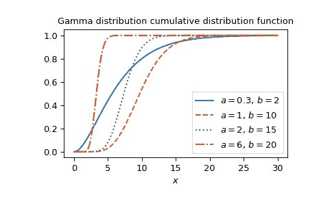

# `scipy.special.gdtr`

> 原文链接：[`docs.scipy.org/doc/scipy-1.12.0/reference/generated/scipy.special.gdtr.html#scipy.special.gdtr`](https://docs.scipy.org/doc/scipy-1.12.0/reference/generated/scipy.special.gdtr.html#scipy.special.gdtr)

```py
scipy.special.gdtr(a, b, x, out=None) = <ufunc 'gdtr'>
```

伽马分布的累积分布函数。

返回从零到*x*的伽马概率密度函数的积分，

\[F = \int_0^x \frac{a^b}{\Gamma(b)} t^{b-1} e^{-at}\,dt,\]

其中\(\Gamma\)为伽马函数。

参数：

**a** 类型为 array_like

伽马分布的率参数，有时标记为\(\beta\)（浮点数）。它也是尺度参数\(\theta\)的倒数。

**b** 类型为 array_like

伽马分布的形状参数，有时标记为\(\alpha\)（浮点数）。

**x** 类型为 array_like

分位数（积分的上限；浮点数）。

**out** ndarray，可选

可选的输出数组用于函数值

返回：

**F**标量或者 ndarray

参数为*a*和*b*的伽马分布的累积分布函数在*x*处的值。

参见

`gdtrc`

伽马分布的累积分布的补函数。

`scipy.stats.gamma`

伽马分布

注意事项

评估使用到不完全伽马积分（正则化伽马函数）的关系。

Cephes 库的包装器[[1]](#r3a02f8e1f0a8-1) `gdtr` 函数。直接调用`gdtr` 可以改善性能，与`scipy.stats.gamma` 的`cdf`方法相比（见下面的最后一个示例）。

参考文献

[1]

Cephes 数学函数库，[`www.netlib.org/cephes/`](http://www.netlib.org/cephes/)

示例

计算`a=1`，`b=2`，`x=5`处的函数值。

```py
>>> import numpy as np
>>> from scipy.special import gdtr
>>> import matplotlib.pyplot as plt
>>> gdtr(1., 2., 5.)
0.9595723180054873 
```

通过提供 NumPy 数组*x*，计算`a=1`和`b=2`的函数值在几个点上。

```py
>>> xvalues = np.array([1., 2., 3., 4])
>>> gdtr(1., 1., xvalues)
array([0.63212056, 0.86466472, 0.95021293, 0.98168436]) 
```

`gdtr` 可以通过提供适合广播的形状的数组来评估不同的参数集合，用于*a*、*b*和*x*。在这里，我们计算三个不同*a*在四个位置*x*和`b=3`的函数值，得到一个 3x4 数组。

```py
>>> a = np.array([[0.5], [1.5], [2.5]])
>>> x = np.array([1., 2., 3., 4])
>>> a.shape, x.shape
((3, 1), (4,)) 
```

```py
>>> gdtr(a, 3., x)
array([[0.01438768, 0.0803014 , 0.19115317, 0.32332358],
 [0.19115317, 0.57680992, 0.82642193, 0.9380312 ],
 [0.45618688, 0.87534798, 0.97974328, 0.9972306 ]]) 
```

绘制四组不同参数设置下的函数图。

```py
>>> a_parameters = [0.3, 1, 2, 6]
>>> b_parameters = [2, 10, 15, 20]
>>> linestyles = ['solid', 'dashed', 'dotted', 'dashdot']
>>> parameters_list = list(zip(a_parameters, b_parameters, linestyles))
>>> x = np.linspace(0, 30, 1000)
>>> fig, ax = plt.subplots()
>>> for parameter_set in parameters_list:
...     a, b, style = parameter_set
...     gdtr_vals = gdtr(a, b, x)
...     ax.plot(x, gdtr_vals, label=f"$a= {a},\, b={b}$", ls=style)
>>> ax.legend()
>>> ax.set_xlabel("$x$")
>>> ax.set_title("Gamma distribution cumulative distribution function")
>>> plt.show() 
```



伽马分布也可以使用`scipy.stats.gamma` 获得。直接使用`gdtr` 比调用`scipy.stats.gamma` 的`cdf`方法要快得多，特别是对于小数组或单个值。要获得相同的结果，必须使用以下参数化方法：`stats.gamma(b, scale=1/a).cdf(x)=gdtr(a, b, x)`。

```py
>>> from scipy.stats import gamma
>>> a = 2.
>>> b = 3
>>> x = 1.
>>> gdtr_result = gdtr(a, b, x)  # this will often be faster than below
>>> gamma_dist_result = gamma(b, scale=1/a).cdf(x)
>>> gdtr_result == gamma_dist_result  # test that results are equal
True 
```
