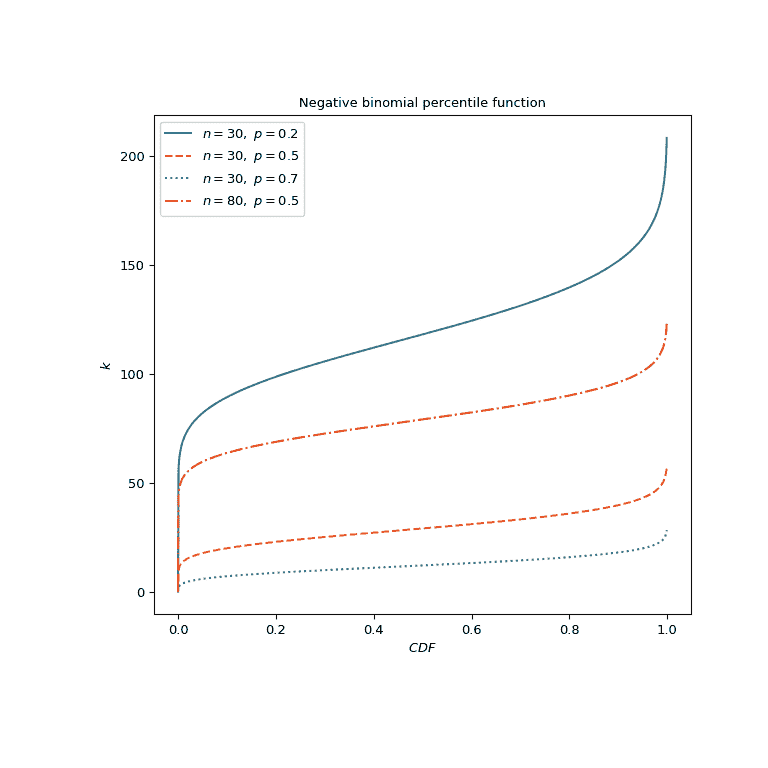

# `scipy.special.nbdtrik`

> 原文：[`docs.scipy.org/doc/scipy-1.12.0/reference/generated/scipy.special.nbdtrik.html#scipy.special.nbdtrik`](https://docs.scipy.org/doc/scipy-1.12.0/reference/generated/scipy.special.nbdtrik.html#scipy.special.nbdtrik)

```py
scipy.special.nbdtrik(y, n, p, out=None) = <ufunc 'nbdtrik'>
```

负二项分布百分位函数。

返回 *y = nbdtr(k, n, p)* 的相对于参数 *k* 的逆，负二项分布累积分布函数。

参数：

**y**，array_like

*k* 或 *n* 成功之前失败的概率（浮点数）。

**n**，array_like

目标成功数（正整数）。

**p**，array_like

单个事件成功的概率（浮点数）。

**out**，ndarray，可选

可选输出数组以获得函数结果

返回：

**k**，标量或 ndarray

允许的最大失败次数，使 *nbdtr(k, n, p) = y*。

另见

`nbdtr`

负二项分布的累积分布函数。

`nbdtrc`

负二项分布的生存函数。

`nbdtri`

*nbdtr(k, n, p)* 相对于 *p* 的逆。

`nbdtrin`

*nbdtr(k, n, p)* 相对于 *n* 的逆。

`scipy.stats.nbinom` 

负二项分布

注释

对 CDFLIB [[1]](#r1c68fb2a79db-1) Fortran 程序库 *cdfnbn* 的包装器。

公式 26.5.26 参见 [[2]](#r1c68fb2a79db-2)，

\[\sum_{j=k + 1}^\infty {{n + j - 1} \choose{j}} p^n (1 - p)^j = I_{1 - p}(k + 1, n),\]

用于将累积分布函数的计算减少到正则不完全贝塔函数 \(I\) 的形式。

计算 *k* 涉及查找产生期望值 *y* 的 *k* 值。该查找依赖于 *y* 随 *k* 的单调性。

参考文献

[1]

Barry Brown, James Lovato 和 Kathy Russell, CDFLIB：Fortran 累积分布函数，逆函数和其他参数的库。

[2]

Milton Abramowitz 和 Irene A. Stegun 编辑，数学函数手册，公式，图表及数学表。纽约：Dover 出版社，1972 年。

示例

计算具有示例参数集的负二项分布累积分布函数。

```py
>>> import numpy as np
>>> from scipy.special import nbdtr, nbdtrik
>>> k, n, p = 5, 2, 0.5
>>> cdf_value = nbdtr(k, n, p)
>>> cdf_value
0.9375 
```

验证 `nbdtrik` 是否恢复了 *k* 的原始值。

```py
>>> nbdtrik(cdf_value, n, p)
5.0 
```

绘制不同参数集的函数图。

```py
>>> import matplotlib.pyplot as plt
>>> p_parameters = [0.2, 0.5, 0.7, 0.5]
>>> n_parameters = [30, 30, 30, 80]
>>> linestyles = ['solid', 'dashed', 'dotted', 'dashdot']
>>> parameters_list = list(zip(p_parameters, n_parameters, linestyles))
>>> cdf_vals = np.linspace(0, 1, 1000)
>>> fig, ax = plt.subplots(figsize=(8, 8))
>>> for parameter_set in parameters_list:
...     p, n, style = parameter_set
...     nbdtrik_vals = nbdtrik(cdf_vals, n, p)
...     ax.plot(cdf_vals, nbdtrik_vals, label=rf"$n={n},\ p={p}$",
...             ls=style)
>>> ax.legend()
>>> ax.set_ylabel("$k$")
>>> ax.set_xlabel("$CDF$")
>>> ax.set_title("Negative binomial percentile function")
>>> plt.show() 
```



负二项分布也可用作`scipy.stats.nbinom`。百分位函数方法 `ppf` 返回了`nbdtrik` 的结果四舍五入到整数：

```py
>>> from scipy.stats import nbinom
>>> q, n, p = 0.6, 5, 0.5
>>> nbinom.ppf(q, n, p), nbdtrik(q, n, p)
(5.0, 4.800428460273882) 
```
