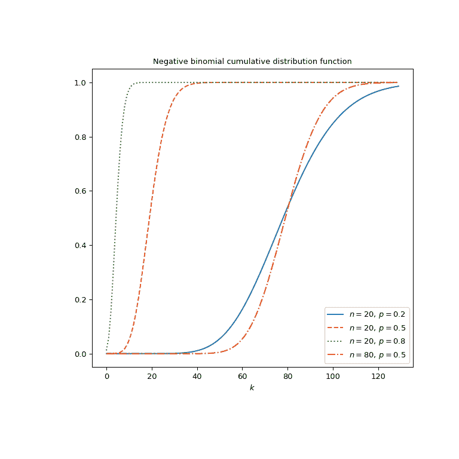

# `scipy.special.nbdtr`

> 原文链接：[`docs.scipy.org/doc/scipy-1.12.0/reference/generated/scipy.special.nbdtr.html#scipy.special.nbdtr`](https://docs.scipy.org/doc/scipy-1.12.0/reference/generated/scipy.special.nbdtr.html#scipy.special.nbdtr)

```py
scipy.special.nbdtr(k, n, p, out=None) = <ufunc 'nbdtr'>
```

负二项分布累积分布函数。

返回负二项分布概率质量函数的前 *k* 项之和，

\[F = \sum_{j=0}^k {{n + j - 1}\choose{j}} p^n (1 - p)^j.\]

在具有各自成功概率 *p* 的伯努利试验序列中，这是第 *n* 次成功之前有 *k* 或更少次失败的概率。

参数：

**k**，array_like

允许的最大失败次数（非负整数）。

**n**，array_like

目标成功次数（正整数）。

**p**，array_like

单次事件成功的概率（浮点数）。

**out**，可选的 ndarray

函数结果的可选输出数组

返回：

**F**，标量或 ndarray

在具有各自成功概率 *p* 的事件序列中，在第 *n* 次成功之前有 *k* 或更少次失败的概率。

另请参阅

`nbdtrc`

负二项分布生存函数

`nbdtrik`

负二项分布分位函数

`scipy.stats.nbinom`

负二项分布

注释

如果 *k* 或 *n* 传递浮点值，它们将被截断为整数。

项不直接求和；而是根据公式使用正则化不完全贝塔函数，

\[\mathrm{nbdtr}(k, n, p) = I_{p}(n, k + 1).\]

Cephes [[1]](#rb09274340cef-1) 程序的包装器 `nbdtr`。

负二项分布也可作为 `scipy.stats.nbinom` 使用。与 `scipy.stats.nbinom` 的 `cdf` 方法相比，直接使用 `nbdtr` 可以提高性能（见最后一个示例）。

参考

[1]

Cephes 数学函数库，[`www.netlib.org/cephes/`](http://www.netlib.org/cephes/)

示例

计算 `k=10`，`n=5`，`p=0.5` 的函数。

```py
>>> import numpy as np
>>> from scipy.special import nbdtr
>>> nbdtr(10, 5, 0.5)
0.940765380859375 
```

通过提供 NumPy 数组或列表作为 *k*，计算 `n=10`，`p=0.5` 的函数在多个点上的值。

```py
>>> nbdtr([5, 10, 15], 10, 0.5)
array([0.15087891, 0.58809853, 0.88523853]) 
```

绘制四组不同参数设置的函数。

```py
>>> import matplotlib.pyplot as plt
>>> k = np.arange(130)
>>> n_parameters = [20, 20, 20, 80]
>>> p_parameters = [0.2, 0.5, 0.8, 0.5]
>>> linestyles = ['solid', 'dashed', 'dotted', 'dashdot']
>>> parameters_list = list(zip(p_parameters, n_parameters,
...                            linestyles))
>>> fig, ax = plt.subplots(figsize=(8, 8))
>>> for parameter_set in parameters_list:
...     p, n, style = parameter_set
...     nbdtr_vals = nbdtr(k, n, p)
...     ax.plot(k, nbdtr_vals, label=rf"$n={n},\, p={p}$",
...             ls=style)
>>> ax.legend()
>>> ax.set_xlabel("$k$")
>>> ax.set_title("Negative binomial cumulative distribution function")
>>> plt.show() 
```



负二项分布也可以使用`scipy.stats.nbinom`来获取。直接使用`nbdtr`可能比调用`scipy.stats.nbinom`的`cdf`方法要快得多，特别是对于小数组或单个值。为了获得相同的结果，必须使用以下参数化方式：`nbinom(n, p).cdf(k)=nbdtr(k, n, p)`。

```py
>>> from scipy.stats import nbinom
>>> k, n, p = 5, 3, 0.5
>>> nbdtr_res = nbdtr(k, n, p)  # this will often be faster than below
>>> stats_res = nbinom(n, p).cdf(k)
>>> stats_res, nbdtr_res  # test that results are equal
(0.85546875, 0.85546875) 
```

通过提供与*k*、*n*和*p*的形状兼容的数组，`nbdtr`可以评估不同的参数集。在这里，我们计算了在四个位置*p*处三个不同*k*的函数，结果是一个 3x4 的数组。

```py
>>> k = np.array([[5], [10], [15]])
>>> p = np.array([0.3, 0.5, 0.7, 0.9])
>>> k.shape, p.shape
((3, 1), (4,)) 
```

```py
>>> nbdtr(k, 5, p)
array([[0.15026833, 0.62304687, 0.95265101, 0.9998531 ],
 [0.48450894, 0.94076538, 0.99932777, 0.99999999],
 [0.76249222, 0.99409103, 0.99999445, 1\.        ]]) 
```
