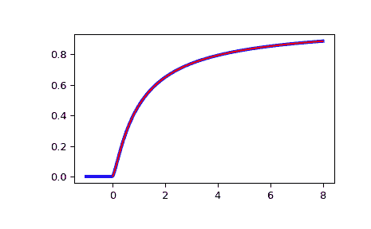

# `scipy.special.ncfdtr`

> 原文链接：[`docs.scipy.org/doc/scipy-1.12.0/reference/generated/scipy.special.ncfdtr.html#scipy.special.ncfdtr`](https://docs.scipy.org/doc/scipy-1.12.0/reference/generated/scipy.special.ncfdtr.html#scipy.special.ncfdtr)

```py
scipy.special.ncfdtr(dfn, dfd, nc, f, out=None) = <ufunc 'ncfdtr'>
```

非中心 F 分布的累积分布函数。

非中心 F 分布描述了分布，

\[Z = \frac{X/d_n}{Y/d_d}\]

其中\(X\)和\(Y\)独立分布，\(X\)为具有非中心参数*nc*和\(d_n\)自由度的非中心\(\chi²\)分布，\(Y\)为具有\(d_d\)自由度的\(\chi²\)分布。

参数：

**dfn**array_like

分子平方和的自由度。范围为(0, inf)。

**dfd**array_like

分母平方和的自由度。范围为(0, inf)。

**nc**array_like

非中心参数。应在范围(0, 1e4)内。

**f**array_like

分位数，即积分的上限。

**out**ndarray，可选

该函数结果的可选输出数组

返回值：

**cdf**标量或 ndarray

计算得到的累积分布函数。如果所有输入都是标量，则返回浮点数；否则返回数组。

另见

`ncfdtri`

分位函数；与*f*相关的`ncfdtr`的逆。

`ncfdtridfd`

与*dfd*相关的`ncfdtr`的逆。

`ncfdtridfn`

与*dfn*相关的`ncfdtr`的逆。

`ncfdtrinc`

与*nc*相关的`ncfdtr`的逆。

注释

CDFLIB 的包装器，对应于 Fortran 例程*cdffnc*。

使用《数学函数手册》第 26.6.20 式计算累积分布函数[[2]](#r10ebdb5a7072-2)：

\[F(d_n, d_d, n_c, f) = \sum_{j=0}^\infty e^{-n_c/2} \frac{(n_c/2)^j}{j!} I_{x}(\frac{d_n}{2} + j, \frac{d_d}{2}),\]

其中\(I\)是正则不完全 Beta 函数，且\(x = f d_n/(f d_n + d_d)\)。

此例程所需的计算时间与非中心参数*nc*成正比。该参数的非常大值可能会消耗巨大的计算资源。这就是为什么搜索范围被限制在 10,000 的原因。

参考文献

[1]

Barry Brown，James Lovato 和 Kathy Russell，CDFLIB：Fortran 例程库用于累积分布函数，逆函数和其他参数。

[2]

Milton Abramowitz 和 Irene A. Stegun，主编。数学函数手册及公式，图表和数学表。纽约：多佛尔出版社，1972 年。

示例

```py
>>> import numpy as np
>>> from scipy import special
>>> from scipy import stats
>>> import matplotlib.pyplot as plt 
```

绘制非中心 F 分布的累积分布函数，当 nc=0 时。与 scipy.stats 中的 F 分布进行比较：

```py
>>> x = np.linspace(-1, 8, num=500)
>>> dfn = 3
>>> dfd = 2
>>> ncf_stats = stats.f.cdf(x, dfn, dfd)
>>> ncf_special = special.ncfdtr(dfn, dfd, 0, x) 
```

```py
>>> fig = plt.figure()
>>> ax = fig.add_subplot(111)
>>> ax.plot(x, ncf_stats, 'b-', lw=3)
>>> ax.plot(x, ncf_special, 'r-')
>>> plt.show() 
```


