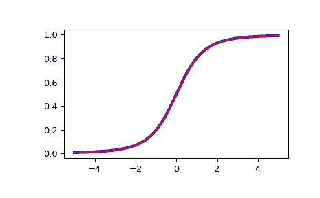

# `scipy.special.nctdtr`

> 原文链接：[`docs.scipy.org/doc/scipy-1.12.0/reference/generated/scipy.special.nctdtr.html#scipy.special.nctdtr`](https://docs.scipy.org/doc/scipy-1.12.0/reference/generated/scipy.special.nctdtr.html#scipy.special.nctdtr)

```py
scipy.special.nctdtr(df, nc, t, out=None) = <ufunc 'nctdtr'>
```

非中心*t*分布的累积分布函数。

参数：

**df** array_like

分布的自由度。应在范围(0, inf)内。

**nc** array_like

非中心参数。应在范围(-1e6, 1e6)内。

**t** array_like

分位数，即积分的上限。

**out** ndarray，可选

用于函数结果的可选输出数组

返回：

**cdf** 标量或 ndarray

计算的 CDF。如果所有输入都是标量，则返回一个浮点数。否则，将返回一个数组。

参见

`nctdtrit`

非中心 t 分布的逆 CDF（iCDF）。

`nctdtridf`

计算自由度，给定 CDF 和 iCDF 值。

`nctdtrinc`

计算非中心参数，给定 CDF iCDF 值。

示例

```py
>>> import numpy as np
>>> from scipy import special
>>> from scipy import stats
>>> import matplotlib.pyplot as plt 
```

绘制非中心 t 分布的 CDF，对于 nc=0 进行比较。与 scipy.stats 中的 t 分布比较：

```py
>>> x = np.linspace(-5, 5, num=500)
>>> df = 3
>>> nct_stats = stats.t.cdf(x, df)
>>> nct_special = special.nctdtr(df, 0, x) 
```

```py
>>> fig = plt.figure()
>>> ax = fig.add_subplot(111)
>>> ax.plot(x, nct_stats, 'b-', lw=3)
>>> ax.plot(x, nct_special, 'r-')
>>> plt.show() 
```


