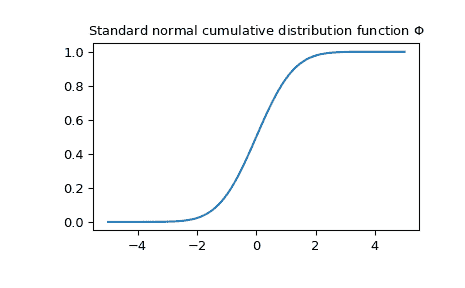

# `scipy.special.ndtr`

> 原文：[`docs.scipy.org/doc/scipy-1.12.0/reference/generated/scipy.special.ndtr.html#scipy.special.ndtr`](https://docs.scipy.org/doc/scipy-1.12.0/reference/generated/scipy.special.ndtr.html#scipy.special.ndtr)

```py
scipy.special.ndtr(x, out=None) = <ufunc 'ndtr'>
```

标准正态分布的累积分布。

返回从负无穷到*x*处标准高斯概率密度函数的积分面积

\[\frac{1}{\sqrt{2\pi}} \int_{-\infty}^x \exp(-t²/2) dt\]

参数：

**x**类似数组，实数或复数

参数

**out** ndarray，可选

函数结果的可选输出数组

返回：

标量或者数组

正态分布的累积分布函数在*x*处的值

另见

`log_ndtr`

ndtr 的对数

`ndtri`

ndtr 的反函数，标准正态分布的百分位函数

`erf`

误差函数

`erfc`

1 - erf

`scipy.stats.norm`

正态分布

示例

在一个点处评估`ndtr`。

```py
>>> import numpy as np
>>> from scipy.special import ndtr
>>> ndtr(0.5)
0.6914624612740131 
```

通过提供 NumPy 数组或列表*x*来评估多个点的函数。

```py
>>> ndtr([0, 0.5, 2])
array([0.5       , 0.69146246, 0.97724987]) 
```

绘制函数。

```py
>>> import matplotlib.pyplot as plt
>>> x = np.linspace(-5, 5, 100)
>>> fig, ax = plt.subplots()
>>> ax.plot(x, ndtr(x))
>>> ax.set_title("Standard normal cumulative distribution function $\Phi$")
>>> plt.show() 
```


