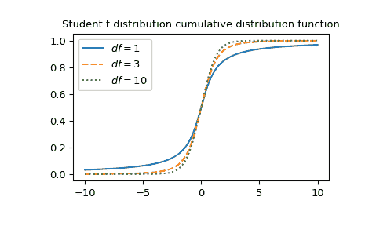

# `scipy.special.stdtr`

> 原文链接：[`docs.scipy.org/doc/scipy-1.12.0/reference/generated/scipy.special.stdtr.html#scipy.special.stdtr`](https://docs.scipy.org/doc/scipy-1.12.0/reference/generated/scipy.special.stdtr.html#scipy.special.stdtr)

```py
scipy.special.stdtr(df, t, out=None) = <ufunc 'stdtr'>
```

学生 t 分布累积分布函数

返回积分：

\[\frac{\Gamma((df+1)/2)}{\sqrt{\pi df} \Gamma(df/2)} \int_{-\infty}^t (1+x²/df)^{-(df+1)/2}\, dx\]

参数：

**df**array_like

自由度

**t**array_like

积分的上界

**out**ndarray，可选

用于输出函数结果的可选输出数组

返回：

标量或 ndarray

t 处的学生 t CDF 值

另见

`stdtridf`

stdtr 的逆函数关于*df*

`stdtrit`

stdtr 的逆函数关于*t*

`scipy.stats.t`

学生 t 分布

注意

学生 t 分布也可以作为`scipy.stats.t`调用。与`scipy.stats.t`的`cdf`方法相比，直接调用`stdtr`可以提高性能（见下面的最后一个例子）。

示例

在`df=3`和`t=1`处计算函数。

```py
>>> import numpy as np
>>> from scipy.special import stdtr
>>> import matplotlib.pyplot as plt
>>> stdtr(3, 1)
0.8044988905221148 
```

绘制三种不同自由度的函数。

```py
>>> x = np.linspace(-10, 10, 1000)
>>> fig, ax = plt.subplots()
>>> parameters = [(1, "solid"), (3, "dashed"), (10, "dotted")]
>>> for (df, linestyle) in parameters:
...     ax.plot(x, stdtr(df, x), ls=linestyle, label=f"$df={df}$")
>>> ax.legend()
>>> ax.set_title("Student t distribution cumulative distribution function")
>>> plt.show() 
```



通过为*df*提供 NumPy 数组或列表，可以同时计算几个自由度的函数：

```py
>>> stdtr([1, 2, 3], 1)
array([0.75      , 0.78867513, 0.80449889]) 
```

可以通过为*df*和*t*提供广播兼容形状的数组，在几个不同自由度同时计算几个点的函数。计算 3 自由度下 4 点的`stdtr`，得到形状为 3x4 的数组。

```py
>>> dfs = np.array([[1], [2], [3]])
>>> t = np.array([2, 4, 6, 8])
>>> dfs.shape, t.shape
((3, 1), (4,)) 
```

```py
>>> stdtr(dfs, t)
array([[0.85241638, 0.92202087, 0.94743154, 0.96041658],
 [0.90824829, 0.97140452, 0.98666426, 0.99236596],
 [0.93033702, 0.98599577, 0.99536364, 0.99796171]]) 
```

学生 t 分布也可以作为`scipy.stats.t`调用。直接调用`stdtr`比调用`scipy.stats.t`的`cdf`方法速度要快得多。为了得到相同的结果，必须使用以下参数化方式：`scipy.stats.t(df).cdf(x) = stdtr(df, x)`。

```py
>>> from scipy.stats import t
>>> df, x = 3, 1
>>> stdtr_result = stdtr(df, x)  # this can be faster than below
>>> stats_result = t(df).cdf(x)
>>> stats_result == stdtr_result  # test that results are equal
True 
```
