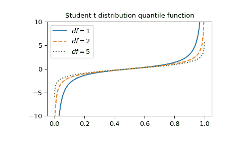

# `scipy.special.stdtrit`

> 原文：[`docs.scipy.org/doc/scipy-1.12.0/reference/generated/scipy.special.stdtrit.html#scipy.special.stdtrit`](https://docs.scipy.org/doc/scipy-1.12.0/reference/generated/scipy.special.stdtrit.html#scipy.special.stdtrit)

```py
scipy.special.stdtrit(df, p, out=None) = <ufunc 'stdtrit'>
```

学生 t 分布的*p*分位数。

此函数是学生 t 分布累积分布函数的逆，返回*t*，使得*stdtr(df, t) = p*。

返回参数*t*，使得 stdtr(df, t)等于*p*。

参数：

**df**array_like

自由度

**p**array_like

概率

**out**ndarray，可选

可选的输出数组用于函数结果

返回：

*t*标量或 ndarray

根据`stdtr(df, t) == p`计算使得*t*等于*p*的值。

另请参阅

`stdtr`

学生 t 分布的累积分布函数

`stdtridf`

*df*的 stdtr 的逆

`scipy.stats.t`

学生 t 分布

注释

学生 t 分布也可以作为`scipy.stats.t`使用。直接调用`stdtrit`相对于`scipy.stats.t`的`ppf`方法可以提高性能（见下面的最后一个例子）。

示例

`stdtrit`表示学生 t 分布的累积分布函数的逆，该函数可作为`stdtr`获得。在此，我们计算`df`在`x=1`时的累积分布函数。`stdtrit`然后返回 1，直到浮点误差给出相同的值用于*df*和计算的累积分布函数值。

```py
>>> import numpy as np
>>> from scipy.special import stdtr, stdtrit
>>> import matplotlib.pyplot as plt
>>> df = 3
>>> x = 1
>>> cdf_value = stdtr(df, x)
>>> stdtrit(df, cdf_value)
0.9999999994418539 
```

绘制三个不同自由度的函数。

```py
>>> x = np.linspace(0, 1, 1000)
>>> parameters = [(1, "solid"), (2, "dashed"), (5, "dotted")]
>>> fig, ax = plt.subplots()
>>> for (df, linestyle) in parameters:
...     ax.plot(x, stdtrit(df, x), ls=linestyle, label=f"$df={df}$")
>>> ax.legend()
>>> ax.set_ylim(-10, 10)
>>> ax.set_title("Student t distribution quantile function")
>>> plt.show() 
```



通过提供*df*的 NumPy 数组或列表，可以同时计算几个自由度的函数。

```py
>>> stdtrit([1, 2, 3], 0.7)
array([0.72654253, 0.6172134 , 0.58438973]) 
```

通过提供形状兼容进行广播的*df*和*p*数组，可以同时计算几个不同自由度的点的函数值。在 3 个自由度的情况下为 4 个点计算`stdtrit`，返回形状为 3x4 的数组。

```py
>>> dfs = np.array([[1], [2], [3]])
>>> p = np.array([0.2, 0.4, 0.7, 0.8])
>>> dfs.shape, p.shape
((3, 1), (4,)) 
```

```py
>>> stdtrit(dfs, p)
array([[-1.37638192, -0.3249197 ,  0.72654253,  1.37638192],
 [-1.06066017, -0.28867513,  0.6172134 ,  1.06066017],
 [-0.97847231, -0.27667066,  0.58438973,  0.97847231]]) 
```

学生 t 分布也可以作为`scipy.stats.t`使用。直接调用`stdtrit`比调用`scipy.stats.t`的`ppf`方法更快。要获得相同的结果，必须使用以下参数化：`scipy.stats.t(df).ppf(x) = stdtrit(df, x)`。

```py
>>> from scipy.stats import t
>>> df, x = 3, 0.5
>>> stdtrit_result = stdtrit(df, x)  # this can be faster than below
>>> stats_result = t(df).ppf(x)
>>> stats_result == stdtrit_result  # test that results are equal
True 
```
