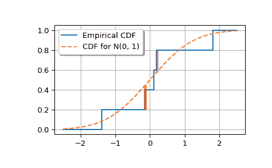

# `scipy.special.smirnov`

> 原文链接：[`docs.scipy.org/doc/scipy-1.12.0/reference/generated/scipy.special.smirnov.html#scipy.special.smirnov`](https://docs.scipy.org/doc/scipy-1.12.0/reference/generated/scipy.special.smirnov.html#scipy.special.smirnov)

```py
scipy.special.smirnov(n, d, out=None) = <ufunc 'smirnov'>
```

Kolmogorov-Smirnov 互补累积分布函数

返回确切的 Kolmogorov-Smirnov 互补累积分布函数（也称为生存函数），Dn+（或 Dn-）的单侧相等性检验的理论分布和经验分布之间的最大差异的概率。它等于基于*n*个样本的理论分布和经验分布之间的最大差异大于 d 的概率。

参数：

**n**int

样本数量

**d**float array_like

经验 CDF（ECDF）与目标 CDF 之间的偏差。

**out**ndarray，可选

函数结果的可选输出数组

返回：

标量或 ndarray

smirnov(n, d)的值，Prob(Dn+ >= d)（也是 Prob(Dn- >= d)）

另请参见

`smirnovi`

分布的逆生存函数

`scipy.stats.ksone`

提供作为连续分布的功能

`kolmogorov`, `kolmogi`

用于双侧分布的函数

注意事项

`smirnov`被*stats.kstest*在 Kolmogorov-Smirnov 拟合度检验中使用。出于历史原因，此函数在*scipy.special*中公开，但实现最精确的 CDF/SF/PDF/PPF/ISF 计算的推荐方法是使用*stats.ksone*分布。

示例

```py
>>> import numpy as np
>>> from scipy.special import smirnov
>>> from scipy.stats import norm 
```

显示大小为 5 的样本至少大于等于 0、0.5 和 1.0 的间隙的概率。

```py
>>> smirnov(5, [0, 0.5, 1.0])
array([ 1\.   ,  0.056,  0\.   ]) 
```

将大小为 5 的样本与 N(0, 1)（均值为 0，标准差为 1）进行比较。

*x*是样本。

```py
>>> x = np.array([-1.392, -0.135, 0.114, 0.190, 1.82]) 
```

```py
>>> target = norm(0, 1)
>>> cdfs = target.cdf(x)
>>> cdfs
array([0.0819612 , 0.44630594, 0.5453811 , 0.57534543, 0.9656205 ]) 
```

构建经验 CDF 和 K-S 统计量（Dn+、Dn-、Dn）。

```py
>>> n = len(x)
>>> ecdfs = np.arange(n+1, dtype=float)/n
>>> cols = np.column_stack([x, ecdfs[1:], cdfs, cdfs - ecdfs[:n],
...                        ecdfs[1:] - cdfs])
>>> with np.printoptions(precision=3):
...    print(cols)
[[-1.392  0.2    0.082  0.082  0.118]
 [-0.135  0.4    0.446  0.246 -0.046]
 [ 0.114  0.6    0.545  0.145  0.055]
 [ 0.19   0.8    0.575 -0.025  0.225]
 [ 1.82   1\.     0.966  0.166  0.034]]
>>> gaps = cols[:, -2:]
>>> Dnpm = np.max(gaps, axis=0)
>>> print(f'Dn-={Dnpm[0]:f}, Dn+={Dnpm[1]:f}')
Dn-=0.246306, Dn+=0.224655
>>> probs = smirnov(n, Dnpm)
>>> print(f'For a sample of size {n} drawn from N(0, 1):',
...       f' Smirnov n={n}: Prob(Dn- >= {Dnpm[0]:f}) = {probs[0]:.4f}',
...       f' Smirnov n={n}: Prob(Dn+ >= {Dnpm[1]:f}) = {probs[1]:.4f}',
...       sep='\n')
For a sample of size 5 drawn from N(0, 1):
 Smirnov n=5: Prob(Dn- >= 0.246306) = 0.4711
 Smirnov n=5: Prob(Dn+ >= 0.224655) = 0.5245 
```

绘制经验 CDF 和标准正态 CDF。

```py
>>> import matplotlib.pyplot as plt
>>> plt.step(np.concatenate(([-2.5], x, [2.5])),
...          np.concatenate((ecdfs, [1])),
...          where='post', label='Empirical CDF')
>>> xx = np.linspace(-2.5, 2.5, 100)
>>> plt.plot(xx, target.cdf(xx), '--', label='CDF for N(0, 1)') 
```

添加标记 Dn+和 Dn-的垂直线。

```py
>>> iminus, iplus = np.argmax(gaps, axis=0)
>>> plt.vlines([x[iminus]], ecdfs[iminus], cdfs[iminus], color='r',
...            alpha=0.5, lw=4)
>>> plt.vlines([x[iplus]], cdfs[iplus], ecdfs[iplus+1], color='m',
...            alpha=0.5, lw=4) 
```

```py
>>> plt.grid(True)
>>> plt.legend(framealpha=1, shadow=True)
>>> plt.show() 
```


