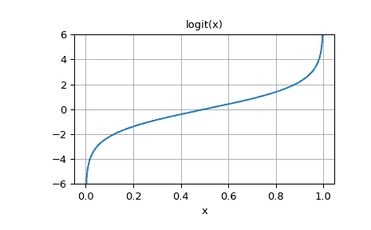

# `scipy.special.logit`

> 原文链接：[`docs.scipy.org/doc/scipy-1.12.0/reference/generated/scipy.special.logit.html#scipy.special.logit`](https://docs.scipy.org/doc/scipy-1.12.0/reference/generated/scipy.special.logit.html#scipy.special.logit)

```py
scipy.special.logit(x, out=None) = <ufunc 'logit'>
```

用于 ndarrays 的 logit ufunc。

logit 函数定义为 logit(p) = log(p/(1-p))。请注意，logit(0) = -inf，logit(1) = inf，而对于 p<0 或 p>1 的 logit(p) 结果为 nan。

参数：

**x** ndarray

ndarray，逐元素应用 logit。

**out** ndarray，可选

函数结果的可选输出数组请注意，以上是根据 Markdown 格式要求翻译后的文本。每一句译文都带有前缀（-  ），符合指定格式。

返回值：

标量或者 ndarray

与 x 形状相同的 ndarray。其条目是对应 x 条目的 logit。

另请参见：

[`expit`](https://docs.scipy.org/doc/scipy-1.12.0/reference/generated/scipy.special.expit.html#scipy.special.expit "scipy.special.expit")

注意：

作为 ufunc，logit 接受多个可选关键字参数。更多信息请参见 [ufuncs](https://docs.scipy.org/doc/numpy/reference/ufuncs.html)

0.10.0 版本新增内容。

示例

```py
>>> import numpy as np
>>> from scipy.special import logit, expit 
```

```py
>>> logit([0, 0.25, 0.5, 0.75, 1])
array([       -inf, -1.09861229,  0\.        ,  1.09861229,         inf]) 
```

[`expit`](https://docs.scipy.org/doc/scipy-1.12.0/reference/generated/scipy.special.expit.html#scipy.special.expit) 是 `logit` 的反函数：

```py
>>> expit(logit([0.1, 0.75, 0.999]))
array([ 0.1  ,  0.75 ,  0.999]) 
```

绘制 logit(x) 在 x 属于 [0, 1] 的范围内：

```py
>>> import matplotlib.pyplot as plt
>>> x = np.linspace(0, 1, 501)
>>> y = logit(x)
>>> plt.plot(x, y)
>>> plt.grid()
>>> plt.ylim(-6, 6)
>>> plt.xlabel('x')
>>> plt.title('logit(x)')
>>> plt.show() 
```


