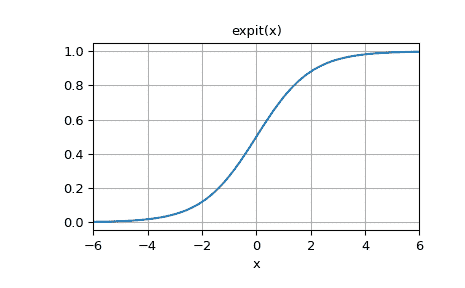

# `scipy.special.expit`

> 原始文本：[`docs.scipy.org/doc/scipy-1.12.0/reference/generated/scipy.special.expit.html#scipy.special.expit`](https://docs.scipy.org/doc/scipy-1.12.0/reference/generated/scipy.special.expit.html#scipy.special.expit)

```py
scipy.special.expit(x, out=None) = <ufunc 'expit'>
```

Expit（又名逻辑 sigmoid）ndarrays 的 ufunc。

expit 函数，也称为逻辑 sigmoid 函数，定义为`expit(x) = 1/(1+exp(-x))`。它是 logit 函数的反函数。

参数：

**x**ndarray

要对每个元素应用`expit`的 ndarray。

**out**ndarray，可选

函数值的可选输出数组

返回：

标量或 ndarray

与 x 相同形状的 ndarray。其条目是相应 x 条目的`expit`。

另请参阅

`logit`

注意事项

作为一个 ufunc，`expit`接受多个可选的关键字参数。更多信息请参见[ufuncs](https://docs.scipy.org/doc/numpy/reference/ufuncs.html)

版本 0.10.0 中的新功能。

示例

```py
>>> import numpy as np
>>> from scipy.special import expit, logit 
```

```py
>>> expit([-np.inf, -1.5, 0, 1.5, np.inf])
array([ 0\.        ,  0.18242552,  0.5       ,  0.81757448,  1\.        ]) 
```

`logit`是`expit`的反函数：

```py
>>> logit(expit([-2.5, 0, 3.1, 5.0]))
array([-2.5,  0\. ,  3.1,  5\. ]) 
```

绘制 expit(x)，其中 x 在[-6, 6]：

```py
>>> import matplotlib.pyplot as plt
>>> x = np.linspace(-6, 6, 121)
>>> y = expit(x)
>>> plt.plot(x, y)
>>> plt.grid()
>>> plt.xlim(-6, 6)
>>> plt.xlabel('x')
>>> plt.title('expit(x)')
>>> plt.show() 
```


