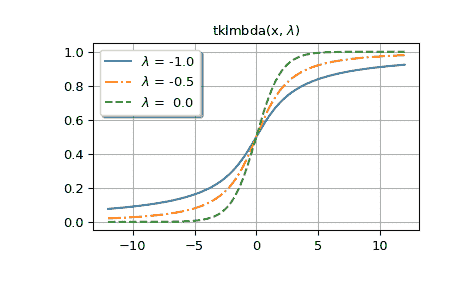
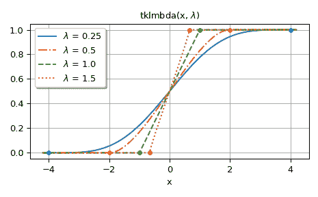

# `scipy.special.tklmbda`

> 原文链接：[`docs.scipy.org/doc/scipy-1.12.0/reference/generated/scipy.special.tklmbda.html#scipy.special.tklmbda`](https://docs.scipy.org/doc/scipy-1.12.0/reference/generated/scipy.special.tklmbda.html#scipy.special.tklmbda)

```py
scipy.special.tklmbda(x, lmbda, out=None) = <ufunc 'tklmbda'>
```

Tukey lambda 分布的累积分布函数。

参数：

**x, lmbda** array_like

参数

**out** ndarray，可选

函数结果的可选输出数组

返回：

**cdf** 标量或 ndarray

Tukey lambda CDF 的值

参见

`scipy.stats.tukeylambda`

Tukey lambda 分布

示例

```py
>>> import numpy as np
>>> import matplotlib.pyplot as plt
>>> from scipy.special import tklmbda, expit 
```

计算[`lmbda`](https://docs.scipy.org/doc/scipy-1.12.0/reference/generated/scipy.special.lmbda.html#scipy.special.lmbda "scipy.special.lmbda")为-1.5 时 Tukey lambda 分布的累积分布函数（CDF）在几个`x`值处的值。

```py
>>> x = np.linspace(-2, 2, 9)
>>> x
array([-2\. , -1.5, -1\. , -0.5,  0\. ,  0.5,  1\. ,  1.5,  2\. ])
>>> tklmbda(x, -1.5)
array([0.34688734, 0.3786554 , 0.41528805, 0.45629737, 0.5       ,
 0.54370263, 0.58471195, 0.6213446 , 0.65311266]) 
```

当[`lmbda`](https://docs.scipy.org/doc/scipy-1.12.0/reference/generated/scipy.special.lmbda.html#scipy.special.lmbda "scipy.special.lmbda")为 0 时，函数为逻辑 sigmoid 函数，在`scipy.special`中实现为`expit`。

```py
>>> tklmbda(x, 0)
array([0.11920292, 0.18242552, 0.26894142, 0.37754067, 0.5       ,
 0.62245933, 0.73105858, 0.81757448, 0.88079708])
>>> expit(x)
array([0.11920292, 0.18242552, 0.26894142, 0.37754067, 0.5       ,
 0.62245933, 0.73105858, 0.81757448, 0.88079708]) 
```

当[`lmbda`](https://docs.scipy.org/doc/scipy-1.12.0/reference/generated/scipy.special.lmbda.html#scipy.special.lmbda "scipy.special.lmbda")为 1 时，Tukey lambda 分布在区间[-1, 1]上均匀分布，因此 CDF 线性增加。

```py
>>> t = np.linspace(-1, 1, 9)
>>> tklmbda(t, 1)
array([0\.   , 0.125, 0.25 , 0.375, 0.5  , 0.625, 0.75 , 0.875, 1\.   ]) 
```

在下文中，我们生成了几个[`lmbda`](https://docs.scipy.org/doc/scipy-1.12.0/reference/generated/scipy.special.lmbda.html#scipy.special.lmbda "scipy.special.lmbda")值的图表。

第一张图显示了当[`lmbda`](https://docs.scipy.org/doc/scipy-1.12.0/reference/generated/scipy.special.lmbda.html#scipy.special.lmbda "scipy.special.lmbda") <= 0 时的图形。

```py
>>> styles = ['-', '-.', '--', ':']
>>> fig, ax = plt.subplots()
>>> x = np.linspace(-12, 12, 500)
>>> for k, lmbda in enumerate([-1.0, -0.5, 0.0]):
...     y = tklmbda(x, lmbda)
...     ax.plot(x, y, styles[k], label=f'$\lambda$ = {lmbda:-4.1f}') 
```

```py
>>> ax.set_title('tklmbda(x, $\lambda$)')
>>> ax.set_label('x')
>>> ax.legend(framealpha=1, shadow=True)
>>> ax.grid(True) 
```

第二张图显示了当[`lmbda`](https://docs.scipy.org/doc/scipy-1.12.0/reference/generated/scipy.special.lmbda.html#scipy.special.lmbda "scipy.special.lmbda") > 0 时的图形。图中的点显示了分布支持的边界。

```py
>>> fig, ax = plt.subplots()
>>> x = np.linspace(-4.2, 4.2, 500)
>>> lmbdas = [0.25, 0.5, 1.0, 1.5]
>>> for k, lmbda in enumerate(lmbdas):
...     y = tklmbda(x, lmbda)
...     ax.plot(x, y, styles[k], label=f'$\lambda$ = {lmbda}') 
```

```py
>>> ax.set_prop_cycle(None)
>>> for lmbda in lmbdas:
...     ax.plot([-1/lmbda, 1/lmbda], [0, 1], '.', ms=8) 
```

```py
>>> ax.set_title('tklmbda(x, $\lambda$)')
>>> ax.set_xlabel('x')
>>> ax.legend(framealpha=1, shadow=True)
>>> ax.grid(True) 
```

```py
>>> plt.tight_layout()
>>> plt.show() 
```



Tukey lambda 分布的累积分布函数也实现为`scipy.stats.tukeylambda`的`cdf`方法。在下文中，`tukeylambda.cdf(x, -0.5)`和`tklmbda(x, -0.5)`计算相同的值：

```py
>>> from scipy.stats import tukeylambda
>>> x = np.linspace(-2, 2, 9) 
```

```py
>>> tukeylambda.cdf(x, -0.5)
array([0.21995157, 0.27093858, 0.33541677, 0.41328161, 0.5       ,
 0.58671839, 0.66458323, 0.72906142, 0.78004843]) 
```

```py
>>> tklmbda(x, -0.5)
array([0.21995157, 0.27093858, 0.33541677, 0.41328161, 0.5       ,
 0.58671839, 0.66458323, 0.72906142, 0.78004843]) 
```

`tukeylambda`中的实现还提供了位置和比例参数，以及其他方法，如`pdf()`（概率密度函数）和`ppf()`（CDF 的反函数），因此对于处理 Tukey lambda 分布，`tukeylambda`更加通用。`tklmbda`的主要优势在于它比`tukeylambda.cdf`快得多。
