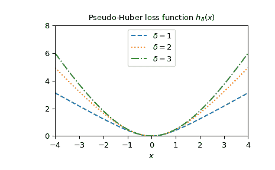
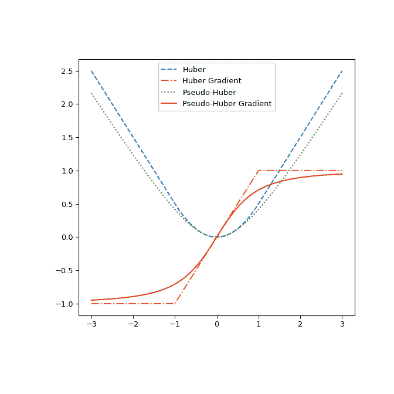

# `scipy.special.pseudo_huber`

> 原文：[`docs.scipy.org/doc/scipy-1.12.0/reference/generated/scipy.special.pseudo_huber.html#scipy.special.pseudo_huber`](https://docs.scipy.org/doc/scipy-1.12.0/reference/generated/scipy.special.pseudo_huber.html#scipy.special.pseudo_huber)

```py
scipy.special.pseudo_huber(delta, r, out=None) = <ufunc 'pseudo_huber'>
```

伪 Huber 损失函数。

\[\mathrm{pseudo\_huber}(\delta, r) = \delta² \left( \sqrt{ 1 + \left( \frac{r}{\delta} \right)² } - 1 \right)\]

参数：

**delta**array_like

输入数组，指示软二次 vs 线性损失的变化点。

**r**array_like

输入数组，可能表示残差。

**out**ndarray，可选

可选的输出数组，用于函数结果

返回：

**res**标量或 ndarray

计算的伪 Huber 损失函数值。

另请参阅

`huber`

与该函数近似的类似函数

注意事项

像`huber`一样，`pseudo_huber`经常用作统计学或机器学习中的鲁棒损失函数，以减少异常值的影响。与`huber`不同，`pseudo_huber`是光滑的。

典型地，*r*代表残差，即模型预测与数据之间的差异。因此，对于\( |r| \leq \delta \)，`pseudo_huber`类似于平方误差，对于\( |r| > \delta \)，则是绝对误差。这样，伪 Huber 损失函数通常能够在小残差（如平方误差损失函数）的模型拟合中快速收敛，并且仍然减少了异常值（\( |r| > \delta \)）的影响。因为\( \delta \)是平方误差和绝对误差区域之间的分界点，对每个问题都需要进行精心调整。`pseudo_huber`也是凸的，适合基于梯度的优化方法。[[1]](#r83de2cc29090-1) [[2]](#r83de2cc29090-2)

新版本 0.15.0 中引入。

参考文献

[1]

Hartley，Zisserman，“计算机视觉中的多视图几何”。2003\. 剑桥大学出版社。p. 619

[2]

Charbonnier 等人，“在计算成像中的确定性边缘保持正则化”。1997\. IEEE 图像处理期刊。6（2）：298-311。

示例

导入所有必要的模块。

```py
>>> import numpy as np
>>> from scipy.special import pseudo_huber, huber
>>> import matplotlib.pyplot as plt 
```

计算`delta=1`时`r=2`的函数。

```py
>>> pseudo_huber(1., 2.)
1.2360679774997898 
```

通过为*delta*提供列表或 NumPy 数组，对`r=2`计算不同*delta*的函数。

```py
>>> pseudo_huber([1., 2., 4.], 3.)
array([2.16227766, 3.21110255, 4\.        ]) 
```

通过为*r*提供列表或 NumPy 数组，对`delta=1`的多个点计算函数。

```py
>>> pseudo_huber(2., np.array([1., 1.5, 3., 4.]))
array([0.47213595, 1\.        , 3.21110255, 4.94427191]) 
```

可以通过提供兼容形状以进行广播的两个数组，对不同的*delta*和*r*计算函数。

```py
>>> r = np.array([1., 2.5, 8., 10.])
>>> deltas = np.array([[1.], [5.], [9.]])
>>> print(r.shape, deltas.shape)
(4,) (3, 1) 
```

```py
>>> pseudo_huber(deltas, r)
array([[ 0.41421356,  1.6925824 ,  7.06225775,  9.04987562],
 [ 0.49509757,  2.95084972, 22.16990566, 30.90169944],
 [ 0.49846624,  3.06693762, 27.37435121, 40.08261642]]) 
```

绘制不同*delta*的函数。

```py
>>> x = np.linspace(-4, 4, 500)
>>> deltas = [1, 2, 3]
>>> linestyles = ["dashed", "dotted", "dashdot"]
>>> fig, ax = plt.subplots()
>>> combined_plot_parameters = list(zip(deltas, linestyles))
>>> for delta, style in combined_plot_parameters:
...     ax.plot(x, pseudo_huber(delta, x), label=f"$\delta={delta}$",
...             ls=style)
>>> ax.legend(loc="upper center")
>>> ax.set_xlabel("$x$")
>>> ax.set_title("Pseudo-Huber loss function $h_{\delta}(x)$")
>>> ax.set_xlim(-4, 4)
>>> ax.set_ylim(0, 8)
>>> plt.show() 
```



最后，通过绘制`huber`和`pseudo_huber`及其关于*r*的梯度，最终说明它们之间的差异。图表显示`pseudo_huber`在点\(\pm\delta\)处是连续可微的，而`huber`则不是。

```py
>>> def huber_grad(delta, x):
...     grad = np.copy(x)
...     linear_area = np.argwhere(np.abs(x) > delta)
...     grad[linear_area]=delta*np.sign(x[linear_area])
...     return grad
>>> def pseudo_huber_grad(delta, x):
...     return x* (1+(x/delta)**2)**(-0.5)
>>> x=np.linspace(-3, 3, 500)
>>> delta = 1.
>>> fig, ax = plt.subplots(figsize=(7, 7))
>>> ax.plot(x, huber(delta, x), label="Huber", ls="dashed")
>>> ax.plot(x, huber_grad(delta, x), label="Huber Gradient", ls="dashdot")
>>> ax.plot(x, pseudo_huber(delta, x), label="Pseudo-Huber", ls="dotted")
>>> ax.plot(x, pseudo_huber_grad(delta, x), label="Pseudo-Huber Gradient",
...         ls="solid")
>>> ax.legend(loc="upper center")
>>> plt.show() 
```


