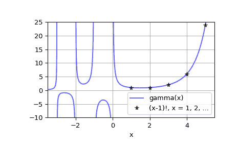

# `scipy.special.gamma`

> 原文链接：[`docs.scipy.org/doc/scipy-1.12.0/reference/generated/scipy.special.gamma.html#scipy.special.gamma`](https://docs.scipy.org/doc/scipy-1.12.0/reference/generated/scipy.special.gamma.html#scipy.special.gamma)

```py
scipy.special.gamma(z, out=None) = <ufunc 'gamma'>
```

伽玛函数

伽玛函数定义为

\[\Gamma(z) = \int_0^\infty t^{z-1} e^{-t} dt\]

对于 \(\Re(z) > 0\)，并通过解析延拓到复平面的其余部分。更多详情请见[[dlmf]](#rc16a1b049558-dlmf)。

参数：

**z** 数组型参数

实数或复数值参数

**out** 数组，可选

可选的输出数组，用于函数值

返回：

标量或者数组

伽玛函数的值

注意

伽玛函数通常被称为广义阶乘，因为对于自然数 \(n\)，\(\Gamma(n + 1) = n!\)。更一般地，对于复数 \(z\)，它满足递推关系 \(\Gamma(z + 1) = z \cdot \Gamma(z)\)，结合事实 \(\Gamma(1) = 1\)，这意味着对于 \(z = n\) 的上述身份成立。

参考文献

[dlmf]

NIST 数字图书馆数学函数 [`dlmf.nist.gov/5.2#E1`](https://dlmf.nist.gov/5.2#E1)

示例

```py
>>> import numpy as np
>>> from scipy.special import gamma, factorial 
```

```py
>>> gamma([0, 0.5, 1, 5])
array([         inf,   1.77245385,   1\.        ,  24\.        ]) 
```

```py
>>> z = 2.5 + 1j
>>> gamma(z)
(0.77476210455108352+0.70763120437959293j)
>>> gamma(z+1), z*gamma(z)  # Recurrence property
((1.2292740569981171+2.5438401155000685j),
 (1.2292740569981158+2.5438401155000658j)) 
```

```py
>>> gamma(0.5)**2  # gamma(0.5) = sqrt(pi)
3.1415926535897927 
```

为实数 \(x\) 绘制伽玛函数 \( \Gamma(x) \)

```py
>>> x = np.linspace(-3.5, 5.5, 2251)
>>> y = gamma(x) 
```

```py
>>> import matplotlib.pyplot as plt
>>> plt.plot(x, y, 'b', alpha=0.6, label='gamma(x)')
>>> k = np.arange(1, 7)
>>> plt.plot(k, factorial(k-1), 'k*', alpha=0.6,
...          label='(x-1)!, x = 1, 2, ...')
>>> plt.xlim(-3.5, 5.5)
>>> plt.ylim(-10, 25)
>>> plt.grid()
>>> plt.xlabel('x')
>>> plt.legend(loc='lower right')
>>> plt.show() 
```


