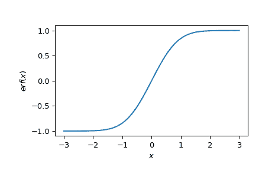

# `scipy.special.erf`

> 原文：[`docs.scipy.org/doc/scipy-1.12.0/reference/generated/scipy.special.erf.html#scipy.special.erf`](https://docs.scipy.org/doc/scipy-1.12.0/reference/generated/scipy.special.erf.html#scipy.special.erf)

```py
scipy.special.erf(z, out=None) = <ufunc 'erf'>
```

返回复数参数的误差函数。

定义为`2/sqrt(pi)*integral(exp(-t**2), t=0..z)`。

参数：

**x**ndarray

输入数组。

**out**ndarray, optional

函数值的可选输出数组

返回：

**res**标量或 ndarray

在给定点*x*处的误差函数值。

另见

`erfc`, `erfinv`, `erfcinv`, `wofz`, `erfcx`, `erfi`

注释

单位正态分布的累积由`Phi(z) = 1/2[1 + erf(z/sqrt(2))]`给出。

参考

[1]

[`en.wikipedia.org/wiki/Error_function`](https://en.wikipedia.org/wiki/Error_function)

[2]

Milton Abramowitz 和 Irene A. Stegun，编辑。数学函数手册，包含公式、图表和数学表。纽约：Dover，1972 年。 [`www.math.sfu.ca/~cbm/aands/page_297.htm`](http://www.math.sfu.ca/~cbm/aands/page_297.htm)

[3]

Steven G. Johnson，Faddeeva W 函数实现。 [`ab-initio.mit.edu/Faddeeva`](http://ab-initio.mit.edu/Faddeeva)

示例

```py
>>> import numpy as np
>>> from scipy import special
>>> import matplotlib.pyplot as plt
>>> x = np.linspace(-3, 3)
>>> plt.plot(x, special.erf(x))
>>> plt.xlabel('$x$')
>>> plt.ylabel('$erf(x)$')
>>> plt.show() 
```


