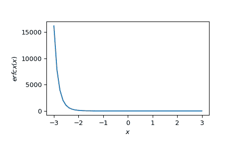

# `scipy.special.erfcx`

> 原文链接：[`docs.scipy.org/doc/scipy-1.12.0/reference/generated/scipy.special.erfcx.html#scipy.special.erfcx`](https://docs.scipy.org/doc/scipy-1.12.0/reference/generated/scipy.special.erfcx.html#scipy.special.erfcx)

```py
scipy.special.erfcx(x, out=None) = <ufunc 'erfcx'>
```

缩放的余补误差函数，`exp(x**2) * erfc(x)`。

参数：

**x**array_like

实数或复数值的参数

**out**ndarray，可选

函数结果的可选输出数组

返回：

标量或者 ndarray

缩放的余补误差函数的值

参见

`erf`，`erfc`，`erfi`，`dawsn`，`wofz`

注释

版本 0.12.0 中的新功能。

参考文献

[1]

Steven G. Johnson，Faddeeva W 函数实现。[`ab-initio.mit.edu/Faddeeva`](http://ab-initio.mit.edu/Faddeeva)

示例

```py
>>> import numpy as np
>>> from scipy import special
>>> import matplotlib.pyplot as plt
>>> x = np.linspace(-3, 3)
>>> plt.plot(x, special.erfcx(x))
>>> plt.xlabel('$x$')
>>> plt.ylabel('$erfcx(x)$')
>>> plt.show() 
```


